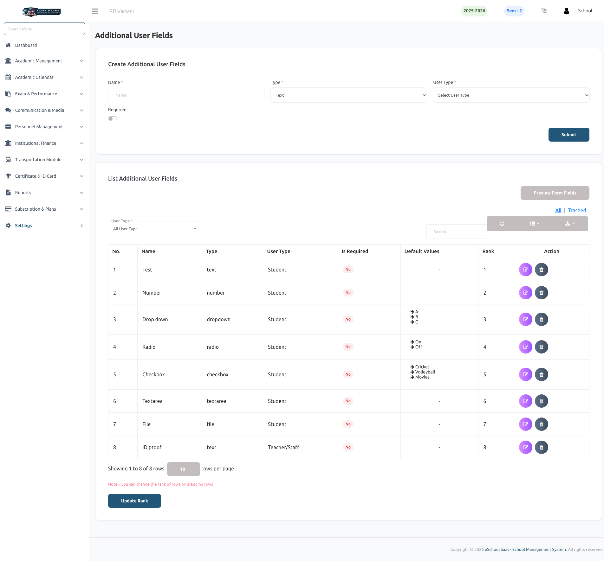

# Additional User Fields

The **Additional User Fields** feature allows school administrators to customize student and staff registration forms by adding unique fields tailored to the school's specific data collection requirements. This flexibility ensures that all necessary information—such as ID proofs, medical history, or extra-curricular interests—can be captured during the onboarding process.

### ➕ Creating Custom Fields
Administrators can create various types of input fields to gather targeted information:
- **Diverse Field Types:** Supports multiple formats including **Text**, **Number**, **Dropdown**, **Radio Buttons**, **Checkboxes**, **Textarea**, and **File** uploads.
- **Specific Targeting:** Define whether each custom field should appear for **Students**, **Teachers/Staff**, or both.
- **Data Validation:** Use the **Required** toggle to make any field mandatory, ensuring essential data is never missed during registration.

### 📋 Managing & Ranking Fields
All custom fields are listed in a structured management table where administrators can control their organization:
- **Interactive Ranking:** Easily change the display order of fields on registration forms by dragging and dropping rows. Simply click **Update Rank** to finalize the sequence.
- **Field Preview:** Use the **Preview Form Fields** button to visualize exactly how the custom fields will appear on the actual registration forms.
- **Administrative Actions:** Quickly edit field properties or delete fields that are no longer required for the school's records.
