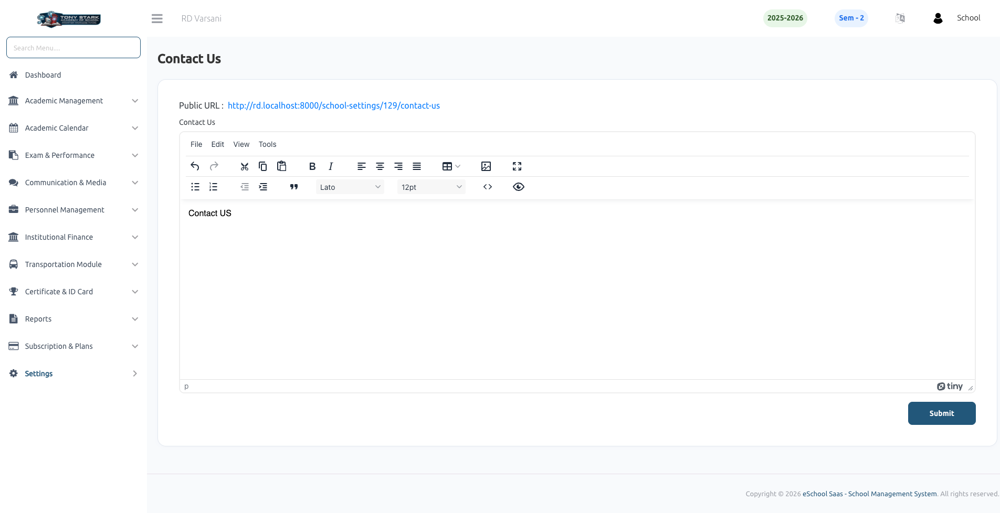

# Contact Us

The **Contact Us** settings enable school administrators to provide essential communication details for parents, students, and the general public. Ensuring this information is accurate is crucial for maintaining effective school-home communication.

### 📞 Contact Details
Administrators can configure the following primary contact information:
- **Contact Phone:** The main telephone number for school inquiries.
- **Contact Email:** The primary email address for receiving support requests or official communications.
- **Contact Address:** The physical location of the school campus.

### 📍 Map Integration
- **Geographic Coordinates:** Enter the **Latitude** and **Longitude** of the school's location to display an interactive map on the contact page. This helps visitors find the campus easily.
- **Interactive View:** Once configured, the map provides a visual guide for parents and visitors to locate the school campus.

