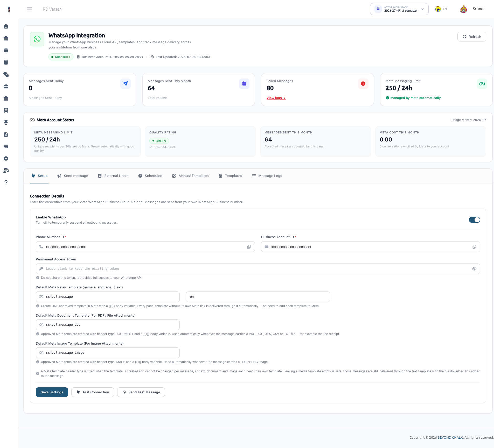
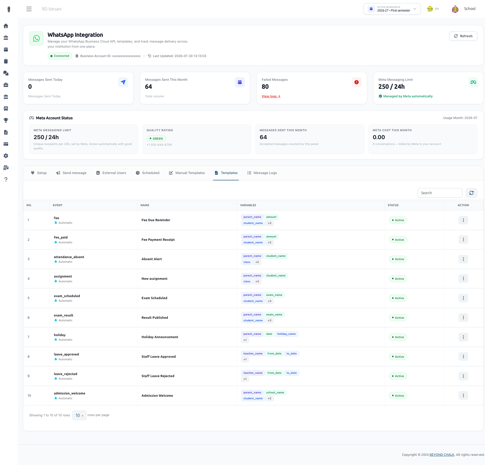
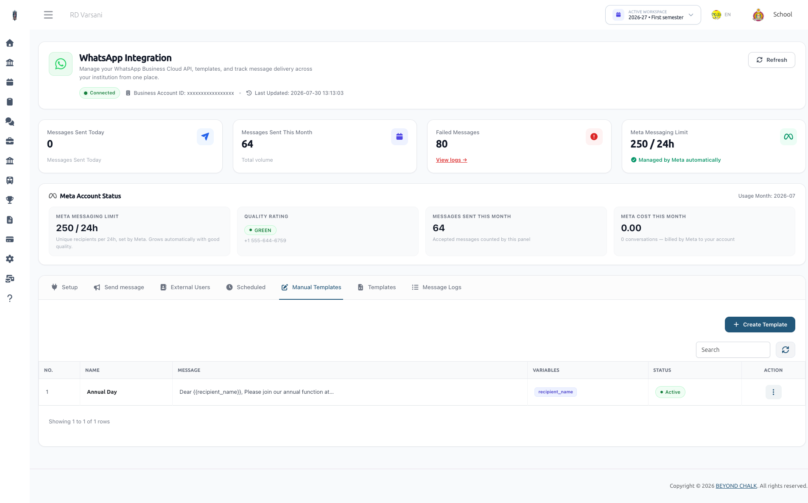
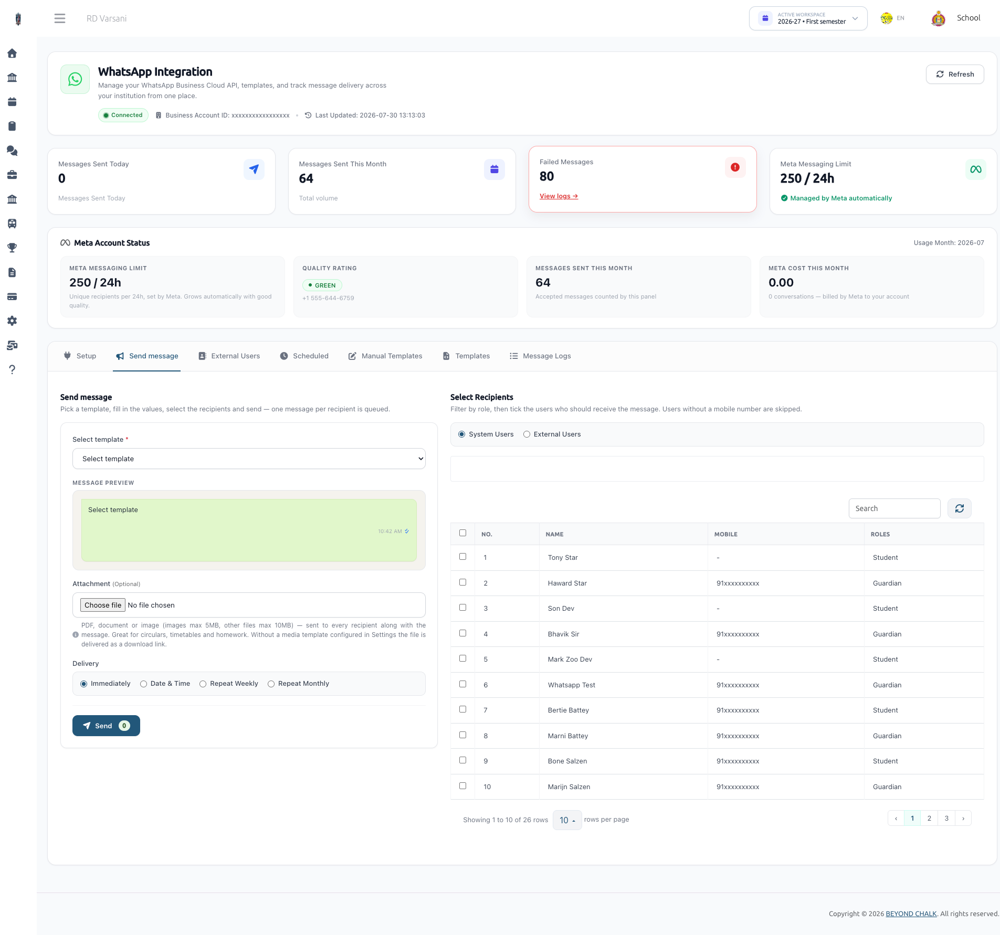
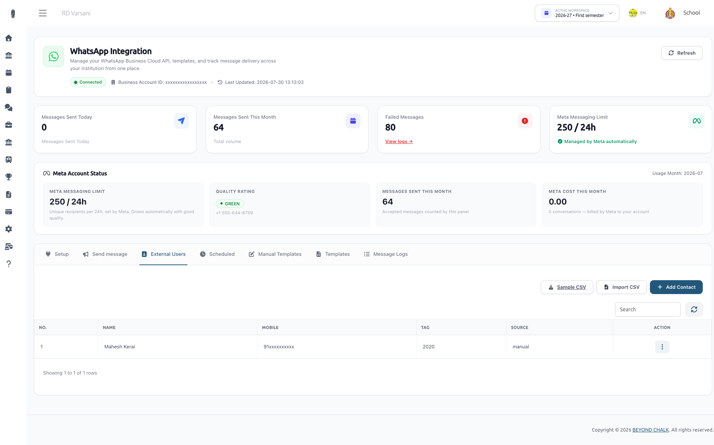
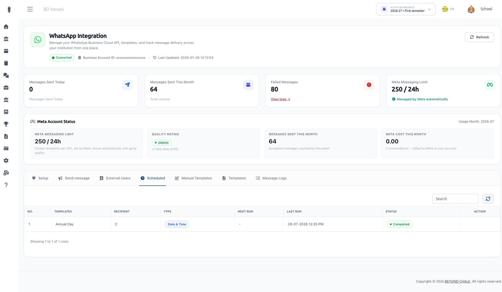
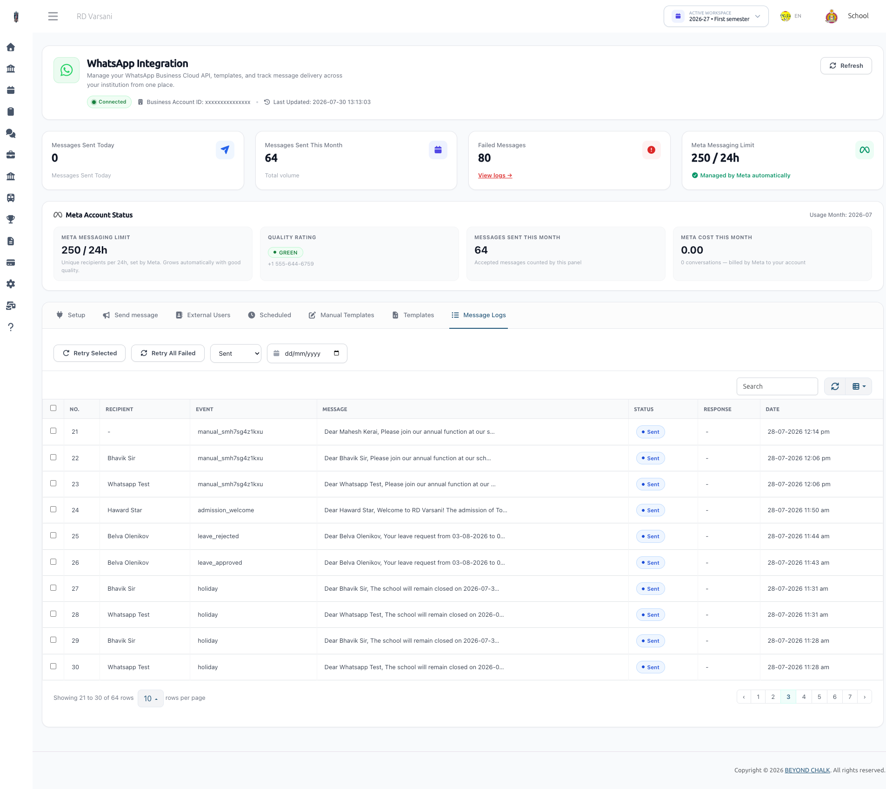

# WhatsApp

### WhatsApp Business API Integration — User & Administrator Guide

Welcome to the comprehensive user guide for the **WhatsApp Integration** module in the School Management System (eSchool SaaS). This guide covers configuration, Meta Cloud API requirements, automatic and manual notification templates, bulk messaging, scheduling, external contact management, troubleshooting, and background process requirements.

:::info Meta WhatsApp Credentials & Templates

For a detailed, step-by-step guide on how to create a Meta Developer account, configure the WhatsApp Business API, generate credentials, and create message templates, please refer to the dedicated **[Meta WhatsApp Credentials Documentation](meta-whatsapp-credentials.md)**.

:::

---

## Table of Contents

1. [Overview](#1-overview)
2. [Meta Developer Account & Required Templates](#2-meta-developer-account--required-templates)
3. [School Administrator Setup & Configuration](#3-school-administrator-setup--configuration)
4. [Automatic System Templates (Event-Driven)](#4-automatic-system-templates-event-driven)
5. [Manual Templates & Custom Bulk Messaging](#5-manual-templates--custom-bulk-messaging)
6. [External Contacts Directory & CSV Import](#6-external-contacts-directory--csv-import)
7. [Scheduled & Recurring Messages](#7-scheduled--recurring-messages)
8. [Message Logs & Retry Mechanism](#8-message-logs--retry-mechanism)
9. [Server & Cron Configuration](#9-server--cron-configuration)
10. [Troubleshooting & Meta Error Codes](#10-troubleshooting--meta-error-codes)

---

## 1. Overview

The WhatsApp Integration module empowers schools to communicate directly with parents, students, teachers, staff, and external contacts (alumni, prospective leads) via the official **Meta WhatsApp Business Cloud API**.

### Key Highlights
* **Multi-Tenant Architecture**: Each school operates independently using its own Meta WhatsApp Business Account credentials and phone number.
* **Automatic Event Triggers**: Instant alerts for fee receipts (with auto-attached PDF invoices), fee due reminders, student absent notifications, exam schedules, exam results, new assignments, holiday announcements, staff leave approvals, and admission welcome messages.
* **Smart Meta Relay System**: Eliminates the need to submit every custom message text to Meta for manual approval. A set of 3 Meta Relay Templates allows the school panel to send dynamic text, images, and documents freely while remaining fully compliant with Meta’s 24-hour messaging window policies.
* **Bulk Messaging & Scheduling**: Broadcast custom messages to targeted user roles or CSV-imported lists immediately or schedule them for single, weekly, or monthly automated execution.
* **Delivery Status Logging & Retry**: Automated log management for sent/failed messages with 1-click retry mechanism.
* **Meta Insights & Cost Monitoring**: Track Meta messaging tier limits, quality rating, and estimated monthly billing directly from the dashboard.

---

## 2. Meta Developer Account & Required Templates

To use WhatsApp messaging, your school (or organization) must create a Meta Developer App connected to a Meta WhatsApp Business Account (WBA).

### Prerequisites from Meta
1. A **Meta Developer Account** at [developers.facebook.com](https://developers.facebook.com/).
2. A **WhatsApp Business Account (WBA)**.
3. A verified **Phone Number ID** added to your WhatsApp Business Account.
4. A **System User Permanent Access Token** (with `whatsapp_business_messaging` and `whatsapp_business_management` permissions).

---

### Required Meta Templates (Meta Cloud Console)

Meta restricts business-initiated messages outside an active 24-hour customer service window to pre-approved templates under the **`Utility`** category.

To support dynamic system messages and custom school broadcasts without requiring approval for every minor text edit, you **MUST create the following 3 Meta Templates** in your Meta WhatsApp Manager before configuring the school panel:

---

#### Template 1: Normal Text Messages (Text Relay)

* **Template Name**: `school_message` *(or any lowercase name using a-z, 0-9, and underscores)*
* **Category**: `Utility`
* **Language**: `English (US)` (`en_US`) or your preferred language code
* **Header**: None (Select *None*)
* **Body**:
```text
Hello, you have a new message from your school:

{{1}}

Thank you.
```
* **Footer**: *(Optional)* e.g., `School Communication Portal`
* **Buttons**: None

---

#### Template 2: Document Attachments (Document Relay)

* **Template Name**: `school_message_document`
* **Category**: `Utility`
* **Language**: `English (US)` (`en_US`)
* **Header**: Select **Document** *(Upload a sample PDF during creation)*
* **Body**:
```text
Hello,

{{1}}

Please find the attached document for your reference.
```
* **Footer**: *(Optional)*
* **Buttons**: None

---

#### Template 3: Image Attachments (Image Relay)

* **Template Name**: `school_message_image`
* **Category**: `Utility`
* **Language**: `English (US)` (`en_US`)
* **Header**: Select **Image** *(Upload a sample JPG/PNG image during creation)*
* **Body**:
```text
Hello,

{{1}}

Please find the attached image for your reference.
```
* **Footer**: *(Optional)*
* **Buttons**: None

---

### How the Meta Relay System Works

```
┌─────────────────────────┐       ┌──────────────────────────┐       ┌────────────────────────┐
│  School Admin Panel     │       │ Meta Utility Template    │       │ Recipient's WhatsApp   │
│  (Custom Body Text &    │ ────> │ Parameter {{1}}          │ ────> │ "Hello, you have a     │
│   Dynamic Variables)    │       │ (Pre-approved by Meta)   │       │  new message: [...]"   │
└─────────────────────────┘       └──────────────────────────┘       └────────────────────────┘
```

When sending any message (automatic or bulk), the system renders all variables (e.g., `{{student_name}}`, `{{amount}}`) locally and passes the final message content as parameter **`{{1}}`** to the corresponding Meta Relay Template. This delivers 100% dynamic messaging with guaranteed Meta compliance.

---

## 3. School Administrator Setup & Configuration

Once your Meta credentials and templates are ready, log in to the School Management System as a **School Admin** and navigate to:

> **WhatsApp Integration** (Sidebar Menu) -> **Setup** Tab



### Step 1: Credentials & Basic Configuration

| Field Name | Description | Example Value |
| :--- | :--- | :--- |
| **Enable WhatsApp** | Master toggle to turn WhatsApp notifications ON/OFF for your school. | `Active (Checked)` |
| **Phone Number ID** | Unique Phone ID generated in Meta Developer Console under WhatsApp -> API Setup. | `104567890123456` |
| **Business Account ID** | WhatsApp Business Account ID found in Meta Business Manager. | `109876543210987` |
| **Permanent Access Token** | System User Permanent Token generated from Business Manager. | `EAAG...` |
| **Default Meta Relay Template (Text)** | Name of Meta Template 1 created above. | `school_message` |
| **Default Meta Language** | Meta language code corresponding to your Meta templates. | `en_US` or `en` |
| **Default Meta Document Template** | Name of Meta Template 2 (Document header). | `school_message_document` |
| **Default Meta Image Template** | Name of Meta Template 3 (Image header). | `school_message_image` |

---

### Step 2: Verify & Test Connection

1. Click **Save Settings**. The system automatically verifies API access.
2. Click **Test Connection**. A green success notification confirms active communication with Meta.
3. Click **Send Test Message**, enter your personal WhatsApp mobile number in international format (e.g., `919876543210`), and verify receipt.

---

## 4. Automatic System Templates (Event-Driven)

The system includes pre-configured automatic templates that trigger instantly upon key school actions. School Admins can enable, disable, or edit the body text of these templates under the **Templates** tab.



### Available Automatic Templates

| Event Key | Template Name | Triggering Event | Supported Variables | Attachment |
| :--- | :--- | :--- | :--- | :--- |
| `fee_paid` | Fee Payment Receipt | When a fee payment is recorded | `{{parent_name}}`, `{{student_name}}`, `{{class}}`, `{{amount}}`, `{{school_name}}` | Auto-generated PDF Fee Receipt |
| `fee` | Fee Due Reminder | Automated or manual fee reminder broadcast | `{{parent_name}}`, `{{student_name}}`, `{{class}}`, `{{amount}}`, `{{due_date}}`, `{{school_name}}` | Optional |
| `attendance_absent` | Absent Alert | When a student is marked Absent in daily attendance | `{{parent_name}}`, `{{student_name}}`, `{{class}}`, `{{date}}`, `{{school_name}}` | None |
| `assignment` | New Assignment | When a teacher assigns a new subject assignment | `{{parent_name}}`, `{{student_name}}`, `{{class}}`, `{{subject}}`, `{{due_date}}`, `{{school_name}}` | Optional File |
| `exam_scheduled` | Exam Scheduled | When an exam timetable is published | `{{parent_name}}`, `{{student_name}}`, `{{class}}`, `{{exam_name}}`, `{{date}}`, `{{school_name}}` | None |
| `exam_result` | Result Published | When exam results/marks are published | `{{parent_name}}`, `{{student_name}}`, `{{class}}`, `{{exam_name}}`, `{{result}}`, `{{school_name}}` | None |
| `holiday` | Holiday Announcement | When a new school holiday is created | `{{parent_name}}`, `{{date}}`, `{{holiday_name}}`, `{{school_name}}` | None |
| `leave_approved` | Staff Leave Approved | When a staff/teacher leave request is approved | `{{teacher_name}}`, `{{from_date}}`, `{{to_date}}`, `{{school_name}}` | None |
| `leave_rejected` | Staff Leave Rejected | When a staff/teacher leave request is rejected | `{{teacher_name}}`, `{{from_date}}`, `{{to_date}}`, `{{school_name}}` | None |
| `admission_welcome` | Admission Welcome | When a student's admission is confirmed | `{{parent_name}}`, `{{student_name}}`, `{{class}}`, `{{gr_number}}`, `{{school_name}}` | None |
| `test_message` | Test Connection Message | Sent when testing the connection from the setup panel | `{{school_name}}` | None |

> [!NOTE]
> All recipient phone numbers are automatically normalized into international format (digits only, e.g., `919876543210`) before sending.

---

## 5. Manual Templates & Custom Bulk Messaging

### Creating Manual Templates
School Admins can create reusable custom templates under the **Manual Templates** tab for circulars, emergency announcements, event invitations, or fee notices:

1. Go to **Manual Templates** tab -> Click **Create Template**.
2. Enter **Template Name** (e.g., *Annual Sports Day Circular*), **Category**, and **Body Text**.
3. Use custom variables in the body if desired (e.g., `Dear {{recipient_name}}, ...`).
4. Click **Save**.



---

### Sending Bulk WhatsApp Messages
To broadcast a message to multiple recipients:

1. Navigate to **Send Message** (Bulk Send) tab.
2. **Select Template**: Pick a Manual Template.
3. **Select Audience**:
   * **System Users**: Filter by user role (Students, Guardians, Teachers, Staff) and select individuals or all users.
   * **External Contacts**: Select pre-saved contacts or upload a CSV on the fly.
4. **Custom Variables**: Fill in variable values if required (e.g., event date, location).
5. **Attachment (Optional)**: Upload a document (`.pdf`, `.docx`, `.xlsx`) or image (`.jpg`, `.png`).
6. **Schedule Option**:
   * **Send Now**: Messages are queued for immediate dispatch.
   * **Schedule Once**: Select future date & time.
   * **Weekly / Monthly**: Recurring automated dispatch.
7. Click **Send WhatsApp Message**.



---

## 6. External Contacts Directory & CSV Import

The **External Users** tab provides a lightweight CRM directory for contacts outside the active registered student/staff list (such as alumni, prospective leads, vendors, or former staff).



### Managing Contacts
* **Add Contact**: Enter Name, Mobile Number (with country code), and an optional **Tag** (e.g. `Alumni 2024`, `Admission Inquiry`).
* **Tagging & Filtering**: Easily select specific tag groups during bulk sends.

---

### CSV Batch Import Semantics
To import hundreds of contacts simultaneously:

1. Click **Import CSV**.
2. Upload a CSV file matching the format below.
3. Specify a **Tag** to assign to all imported contacts.

#### CSV Format Specification
```csv
mobile,name
919876543210,Ramesh Shah
918855885588,"Patel, Priya"
917000000001,Alumni 2020 Batch
```

> [!TIP]
> **Duplicate Protection & Upserting**: Re-importing a CSV file with the same mobile numbers will update the contact's name and tag without creating duplicate records.

---

## 7. Scheduled & Recurring Messages

View and manage all scheduled dispatches under the **Scheduled** tab.



### Supported Schedule Types
* **Once**: Executes at the designated future date and time, then marks as `completed`.
* **Weekly**: Executes automatically every 7 days from the start time.
* **Monthly**: Executes automatically on the same day every month.

### Managing Schedules
* Admins can view the next run date, recipient count, and status.
* Pending schedules can be **Cancelled** at any time prior to execution.

---

## 8. Message Logs & Retry Mechanism

Track every outbound WhatsApp message under the **Message Logs** tab.



### Status Indicators

| Status Pill | Description |
| :--- | :--- |
| <span style={{color: 'blue'}}>● Pending</span> | Queued in the system, awaiting worker execution. |
| <span style={{color: 'green'}}>● Sent</span> | Successfully accepted and dispatched by Meta API. |
| <span style={{color: 'red'}}>● Failed</span> | Delivery failed (reason logged in response column). |

---

### Retrying Failed Messages
If a message fails (e.g. due to temporary network downtime or Meta API throttling):

1. Go to **Message Logs**.
2. Filter status by **Failed**.
3. Select specific failed logs and click **Retry Selected**, or click **Retry All Failed**.
4. The system re-queues the exact rendered message while preserving the single log history record.

---

## 9. Server & Cron Configuration

For proper asynchronous delivery and automated schedule execution, the server must have the Laravel Queue Worker and Cron Scheduler active.

### 1. Queue Worker Process
All WhatsApp messages are dispatched asynchronously via `SendWhatsAppJob` to prevent slowing down web request response times.

Run worker daemon:
```bash
php artisan queue:work --tries=3 --timeout=60
```

*(In production, manage `php artisan queue:work` using Supervisor or Systemd)*

---

### 2. Cron Scheduler (Scheduled Messages)
To process scheduled WhatsApp messages, add the standard Laravel cron job to your server's crontab:

```bash
* * * * * cd /path-to-your-project && php artisan schedule:run >> /dev/null 2>&1
```

Or execute the dedicated WhatsApp scheduled command directly via cron:
```bash
* * * * * cd /path-to-your-project && php artisan whatsapp:process-scheduled >> /dev/null 2>&1
```

---

## 10. Troubleshooting & Meta Error Codes

### Common Meta API Errors & Resolutions

| Error Code | Error Message / Cause | Resolution |
| :--- | :--- | :--- |
| **131030** | *Recipient phone number not allowed* | The recipient phone number is not registered on WhatsApp or, if using a Meta Test Phone Number, the recipient number has not been added to Meta's test numbers list. |
| **132001** | *Template does not exist in target language* | Verify that the template name typed in panel settings matches the exact lowercase name in Meta Developer Manager and that the language code (e.g. `en_US`) matches. |
| **132000** | *Number of parameters does not match* | Ensure your Meta Relay Template contains `{{1}}` in its body text. |
| **131053** | *Media upload error / Unable to fetch media* | Ensure your server's public storage disk is accessible over HTTPS so Meta servers can download attachments. |
| **HTTP 401** | *OAuthException / Invalid Token* | Your Meta Permanent Access Token is expired, invalid, or missing required permissions (`whatsapp_business_messaging`). Regenerate token in Business Manager. |

---

## Summary Checklist for System Administrator

- [x] Create Meta Developer App & WhatsApp Business Account.
- [x] Create 3 Utility Meta Relay Templates (`school_message`, `school_message_document`, `school_message_image`).
- [x] Configure Phone Number ID, WBA ID, and Access Token in School Admin Setup.
- [x] Test Connection and send Test Message.
- [x] Enable & customize Automatic Templates.
- [x] Ensure Queue Worker and Cron Scheduler are running on server.

---
