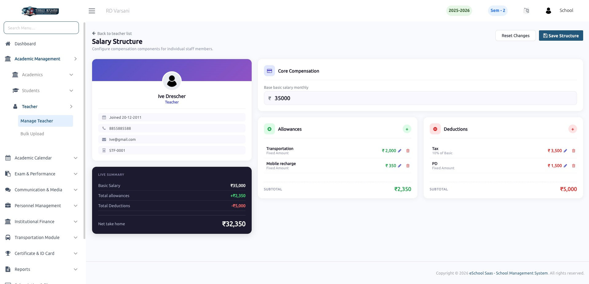

# Salary Structure

### Salary Structure Management (Allowances & Deductions)
The Admin can manage and configure a staff member’s complete salary structure from this page.

### Core Salary Configuration
* Define the **base monthly salary** for the staff member.
* This amount acts as the foundation for all allowances and deductions calculations.

---

### Allowance Management
Add multiple allowances to the salary structure, such as:
* Transportation
* Mobile reimbursement
* Bonuses or other benefits

Each allowance can be configured as:
* **Fixed amount** (e.g., ₹2,000)
* **Percentage of basic salary** (if applicable)

Admin can:
* Add new allowances
* Edit existing ones
* Remove allowances as needed

*A subtotal of all allowances is automatically calculated and displayed.*

---

### Deduction Management
Define salary deductions such as:
* Tax
* Provident Fund (PF) or other statutory deductions
* Penalties or custom deductions

Deductions can be:
* **Fixed amount**
* **Percentage-based** (e.g., % of basic salary)

Admin has full control to:
* Add, update, or delete deductions

*A subtotal of all deductions is calculated in real time.*

---

### Real-Time Salary Summary
The system provides a live summary panel including:
* **Basic Salary**
* **Total Allowances**
* **Total Deductions**
* **Net Take-Home Salary**

*All values are updated instantly as changes are made.*

---

### Actions & Controls
* **Save Structure:** Apply and store the configured salary structure.
* **Reset Changes:** Discard unsaved modifications and revert to the previous state.

---

### Key Benefits
* **Centralized salary configuration** for each staff member.
* **Real-time calculation** ensures transparency and accuracy.
* **Flexible structure** supporting multiple earning and deduction types.
* **Reduces manual errors** in payroll processing.

