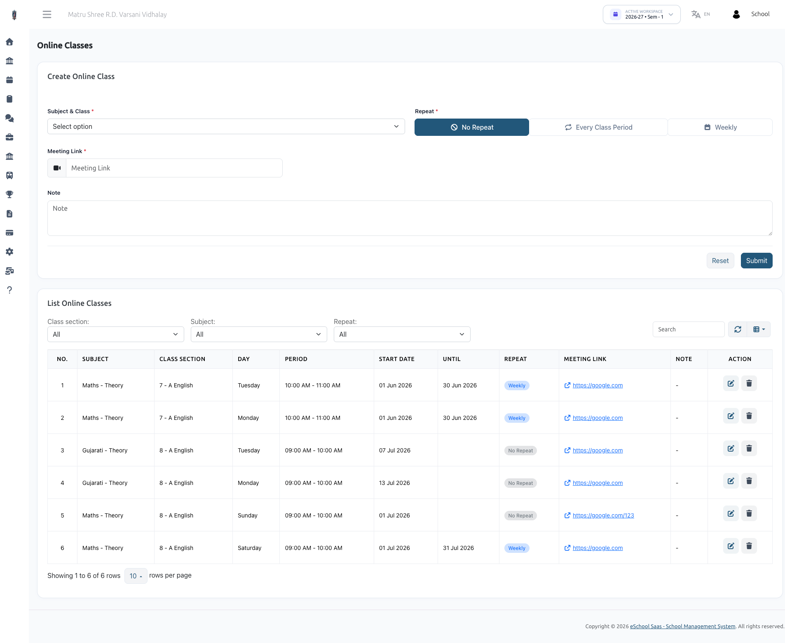

# Online Classes

## 1. ONLINE CLASS MODULE
The Online Class Module integrates seamlessly with the existing Timetable Management system, allowing teachers and administrators to schedule virtual lectures and attach meeting links directly to students' class periods.

### 1.1 Overview & Key Features
- **Timetable Integration**: Online classes are attached directly to existing timetable slots, ensuring no scheduling conflicts and retaining the established class structure.
- **Flexible Recurring Schedules**: Options to schedule one-off meetings, repeat the meeting link for "Every Class Period", or set up weekly recurring virtual classes.
- **Date-Bounded Links**: Set specific "Start Date" and "End Date" limits to control when a meeting link is active and visible.
- **Granular Filtering**: Search and filter scheduled online classes by Class Section, Subject, or Repeat pattern.
- **Non-Destructive Deletion**: Removing an online class only clears the meeting link, preserving the underlying academic timetable slot for physical classes.

### 1.2 Creating an Online Class
Navigate to **Timetable Management &rarr; Online Classes**.

**Step-by-Step Scheduling:**
- **Select Subject & Class**: Choose the specific Subject, Class Section, and Teacher combination. (Note: Only subjects that have existing pre-scheduled timetable slots will appear in this list).
- **Select Repeat Type**:
  - **No Repeat**: A one-time online class for a specific upcoming date.
  - **Every Class Period**: Automatically attaches the meeting link to all existing periods for this subject.
  - **Other Options (e.g., Weekly)**: Allows selecting specific recurring patterns.
- **Choose Periods**: If not selecting "Every Class Period", check the boxes for the specific timetable periods you wish to attach the virtual link to.
- **Set Dates**:
  - **Start Date**: When the online class link becomes active.
  - **End Date**: Until when the online class repeats.
- **Add Meeting Link & Notes**: Paste the Zoom, Google Meet, or Teams URL and add any optional instructions.
- **Submit**: The meeting link is instantly propagated to the selected timetable periods.

### 1.3 Managing & Editing Online Classes
**Filtering & Listing:**
The List Online Classes table displays all active virtual classes. Use the top toolbar to filter by:
- Class Section
- Subject
- Repeat Type

**Actions:**
- **Edit (Pencil Icon)**: Modify the Meeting Link, Start/End Dates, Repeat Type, or Notes. The Subject and Period cannot be changed after creation (to change these, delete and recreate the online class).
- **Delete (Trash Icon)**: Removes the meeting link and online schedule. Note: This does not delete the actual lecture period from the school timetable, it only removes the virtual meeting link.
