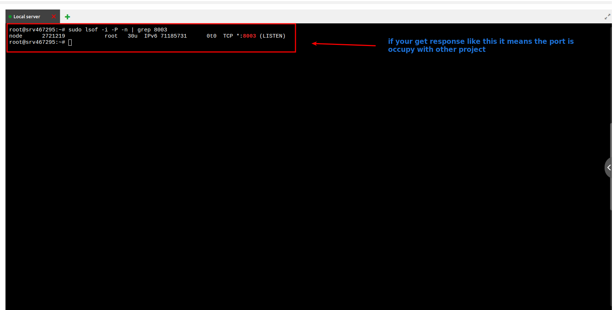
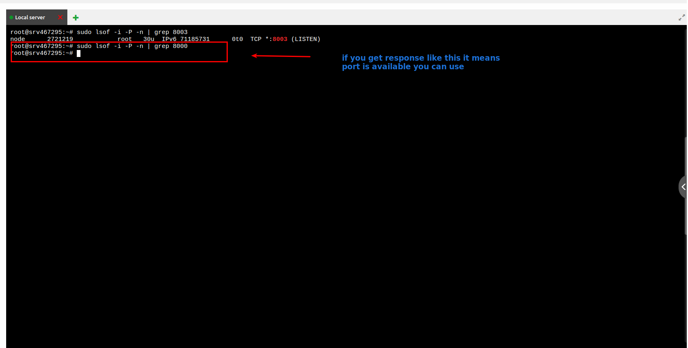
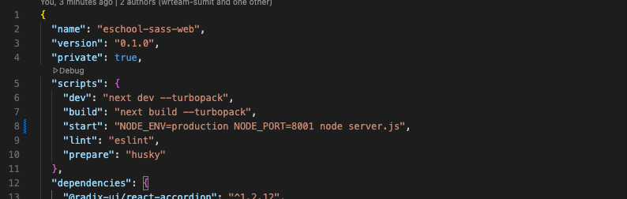

# Deployment Guide

This guide covers deploying the Student Web Portal to production environments.

## Prerequisites

Before deployment, ensure:

- Application is tested locally
- Production environment variables are configured
- Admin Panel API is accessible from production
- Domain name and SSL certificate (for HTTPS)

## Deployment Options

### Option 1: Deploy on Vercel

#### Step 1: Prepare for Vercel

1. **Remove Static Export**:
   Open `next.config.js` and **remove** the line `output: 'export'`. Vercel handles the build automatically and supports dynamic features.

2. **No .htaccess Needed**:
   Vercel uses its own routing, so you do **not** need the `.htaccess` file configuration.

#### Step 2: Deploy via GitHub

1. Push your code to a GitHub repository.
2. Log in to [Vercel](https://vercel.com) using your GitHub account.
3. Click **"Add New..."** -> **"Project"**.
4. Import your repository.
5. Vercel will auto-detect Next.js. Click **Deploy**.
6. Your site will be live in minutes!

### Option 2: Deploy on VPS Server

#### Web Automatic Deployment

Upload your web code to your server, open the terminal, navigate to your web code directory, and run the **./install.sh** command.

#### Web Manually Deployment

:::warning

- Deployment of the Next JS needs a bit of knowledge about `node js` `npm` `pm2` technologies. We have assumed that you are using a `debian` based OS, apt is your package manager. If you are using any other linux distro then apt will be replaced with the respective package manager of the OS

- We do not recommend deploying on shared hosting as it may not support all Node.js features. If you do not have a VPS server, you can proceed with this method, but we cannot provide support for any issues that arise.

:::

Before starting the project deployment, you must upload your project to the server. Project can be upload to the server using [FileZila](https://filezilla-project.org/download.php) or in other ways.

##### Installing NodeJS

NodeJS can be installed using NVM by which multi Node version can be controlled easily.

```bash
sudo apt install curl
curl https://raw.githubusercontent.com/creationix/nvm/master/install.sh | bash
nvm install node 20.*
```

Check if node js is installed correctly using this command:

```bash
node -v
```

:::info

For more information, use [official documentation](https://nodejs.org/docs/latest/api/)

:::

##### Installing PM2 Server

By running the following command, PM2 server can be installed globally:

```bash
npm install pm2 -g
```

##### Set Port

Before setting the port, check available ports with this command:

```bash
sudo lsof -i -P -n | grep 8003
```



If you get a response like this it means this port is occupied with another project, so try another port (e.g. 8000, 8001, 8002, 8003, 8004, etc.)



If you get a response like this it means this port is available and you can use it.

Now add the available port to your `package.json` file:



##### Configure .htaccess

Add the following configuration to your `.htaccess` file. Make sure to replace `8004` with the port you set in your `package.json`:

```apache
<IfModule mod_rewrite.c>
    RewriteEngine On
    RewriteBase /

    RewriteRule ^/.well-known/acme-challenge/(.*) /.well-known/acme-challenge/$1 [L]

    RewriteRule ^_next/(.*) /.next/$1 [L]
    # Allow access to static files with specific extensions
    RewriteCond %{REQUEST_URI} \.(js|css|svg|jpg|jpeg|png|gif|ico|woff2)$
    RewriteRule ^ - [L]

    RewriteRule ^index.html http://127.0.0.1:8004/$1 [P]
    RewriteRule ^index.php http://127.0.0.1:8004/$1 [P]
    RewriteRule ^/?(.*)$ http://127.0.0.1:8004/$1 [P]
</IfModule>
```

##### Setup the Project

:::note

Make sure you have `node_modules` installed in your directory.

:::

For installing packages, run the following command:

```bash
npm install
```

The above command will install all the **node modules** in your directory.

After that, the project must be built. Run the following command, which will build the production application in the **.next** folder:

```bash
npm run build
```

##### Run the PM2 Server

Go to the project root and run the following command:

```bash
pm2 start "npm start" -n "YOUR_PROJECT_NAME"
```

Check if the PM2 process is running OK:

```bash
pm2 ls
```

When you run `pm2 ls` you will see 2 types of output:

1. **Error** — If you are getting errors in the PM2 process, then run `pm2 logs` and send us a screenshot of the error so that we can guide you to resolve the issues.

2. **Success** — If successful, set up a startup script for your operating system to ensure PM2 restarts automatically after a system reboot:

   ```bash
   pm2 startup
   ```

   After setting up PM2 with the startup command, save the current process list:

   ```bash
   pm2 save
   ```

   If you want to restart your PM2 process, run:

   ```bash
   pm2 restart id  # Replace id with your process id
   ```

For deleting a previous project running in the PM2 server, use the following command:

```bash
pm2 delete "YOUR_PROJECT_NAME"
```

:::info

For more information, use [official documentation](https://pm2.keymetrics.io/docs/usage/quick-start/)

:::

## Troubleshooting

### Issue: White Screen After Deployment

**Solution**:

- Check browser console for errors
- Verify `PUBLIC_URL` in `.env`
- Check build file paths

### Issue: API Calls Failing

**Solution**:

- Verify API URL in production environment
- Check CORS configuration
- Ensure API is accessible from production server

### Issue: Routes Not Working

**Solution**:

- Configure server to redirect all routes to `index.html`
- Check `.htaccess` or Nginx configuration
