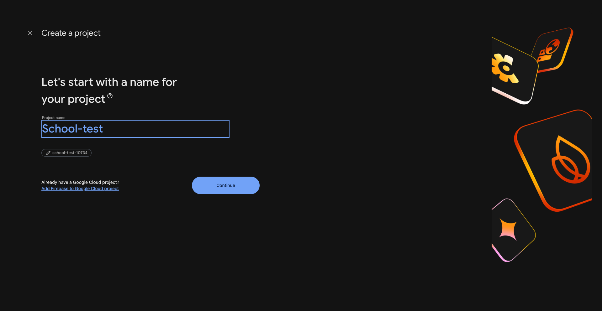
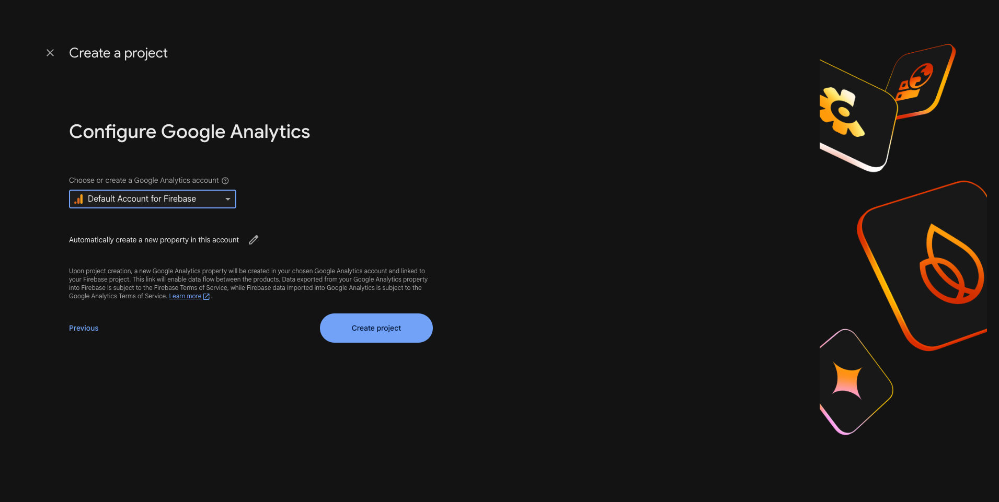
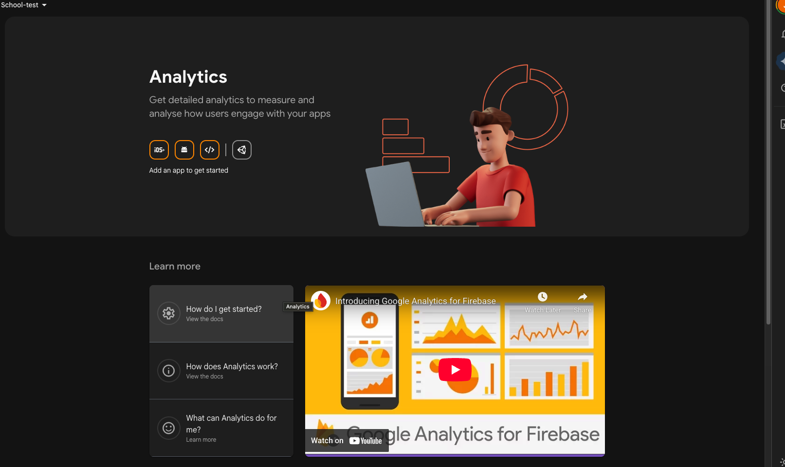
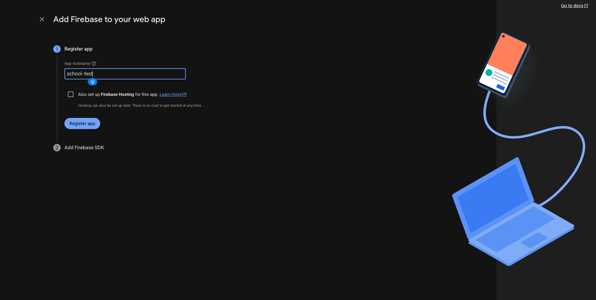
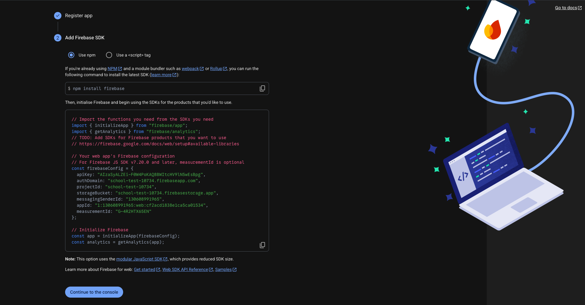
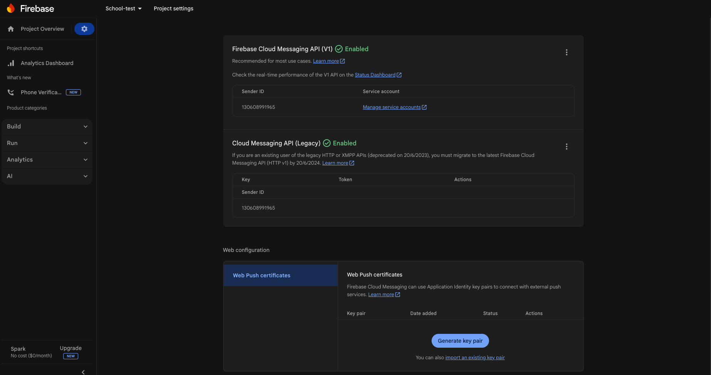
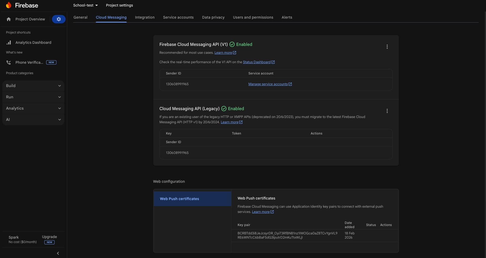
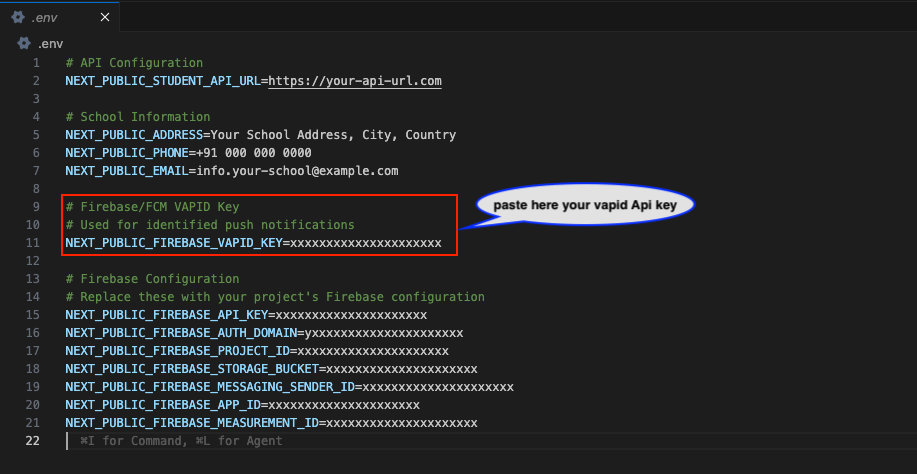

# 🔥 Firebase Setup

The Student Web Portal uses Firebase Cloud Messaging (FCM) to deliver push notifications to students for assignments, exams, and school updates.

## 1. Create a Firebase Project

1. Go to the [Firebase Console](https://console.firebase.google.com/).
2. Click **Add Project** and give it a name (e.g., "eSchool Student Web").



3. Follow the steps and click **Create Project**.



## 2. Register Your Web App

1. In your project dashboard, click the **Web icon (`</>`)** to add a new app.



2. Enter an app nickname (e.g., "Student Portal").



3. Click **Register app**.
4. You will see a `firebaseConfig` object. Keep this window open or copy the values.



## 3. Enable Cloud Messaging

1. Go to **Project Settings** (gear icon) → **Cloud Messaging**.
2. Under **Firebase Cloud Messaging API (V1)**, ensure it is enabled.
3. Scroll down to **Web configuration** → **Web Push certificates**.



4. Click **Generate key pair**. This is your **VAPID Key**. Copy it.



## 4. Update Project Files

### A. Environment Variables

Add the configuration values to your `.env.local` file as shown in the **[Installation Steps](./installation-steps.md#step-4-configure-environment-variables)** guide.



### B. Service Worker

Update the Firebase configuration in `public/firebase-messaging-sw.js`.

1. Open `public/firebase-messaging-sw.js` in your editor.
2. Update the `firebaseConfig` object with your credentials (around line 30).

```javascript
// public/firebase-messaging-sw.js

const firebaseConfig = {
  apiKey: "your-api-key",
  authDomain: "your-project.firebaseapp.com",
  projectId: "your-project-id",
  storageBucket: "your-project.firebasestorage.app",
  messagingSenderId: "your-sender-id",
  appId: "your-app-id",
  measurementId: "your-measurement-id",
};
```

**Note:** The service worker file uses raw configuration values and doe not require the `NEXT_PUBLIC_` prefix.

## 5. Verification

1. Deploy your app to an **HTTPS** domain (Firebase notifications require HTTPS).
2. Open the portal in your browser.
3. You should see a prompt asking for notification permissions.
4. If allowed, the device will be registered for push notifications.

:::tip Push Notifications and Localhost
Firebase push notifications generally do not work on `http://localhost` (except for some browsers under specific conditions). Always test on a secure `https://` domain.
:::
