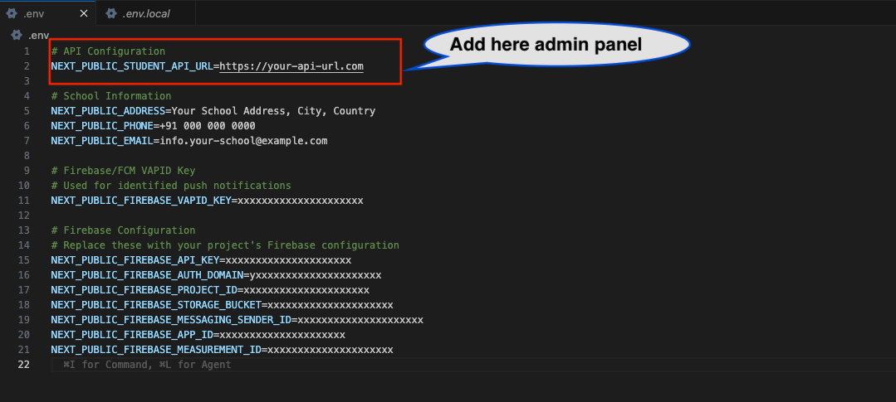

# Installation Steps

This guide will walk you through the process of installing and setting up the Student Web Portal for production deployment.

## Prerequisites

Before you begin, ensure you have the following:

### Required Tools

1. **VS Code Editor** - Download from [https://code.visualstudio.com/](https://code.visualstudio.com/)
   - Free, lightweight code editor from Microsoft
   - Recommended for editing the project files

2. **Node.js (Version 20)** - Download from [https://nodejs.org/en/download/prebuilt-installer](https://nodejs.org/en/download/prebuilt-installer)
   - Required to build the project
   - Choose the LTS (Long Term Support) version 20
   - Includes npm (Node Package Manager) automatically

3. **Firebase Account** - Create account at [https://console.firebase.google.com/](https://console.firebase.google.com/)
   - Required for push notifications
   - Free tier is sufficient for most use cases

4. **Web Hosting Server**
   - Domain or subdomain for the Student Web Portal
   - Access to upload files (cPanel, FTP, or similar)

### Required Files

- Student Web Portal source code (purchased from CodeCanyon)
- Admin Panel URL (must be running and accessible)

## Installation Process

Follow these steps carefully to set up the Student Web Portal:

### Step 1: Extract the Source Code

Extract the ZIP file of the Student Web code that you received from CodeCanyon.

1. Locate the downloaded ZIP file
2. Right-click and select "Extract All" (Windows) or double-click (macOS)
3. Extract to a location you can easily access (e.g., Desktop or Documents folder)

### Step 2: Open Project in VS Code

Open the extracted project folder in VS Code editor.

1. Launch VS Code
2. Click **File** → **Open Folder**
3. Navigate to the extracted `eschool-sass-web` folder
4. Click **Select Folder** to open the project

### Step 3: Install Node.js

Download and install Node.js version 20 if not already installed.

**Download Link:** [https://nodejs.org/en/download/prebuilt-installer](https://nodejs.org/en/download/prebuilt-installer)

1. Select **Node.js 20 LTS** version
2. Choose your operating system (Windows/macOS/Linux)
3. Download and run the installer
4. Follow the installation wizard (use default settings)
5. Verify installation by opening Terminal/Command Prompt and typing:

```bash
node --version
npm --version
```

**Note:** If Node.js is already installed, skip this step.

### Step 4: Configure Environment Variables

The Student Web Portal uses environment variables to configure API connections and branding details. These variables are stored in a `.env.local` file in the project root.

1. In VS Code, locate the `.env.local` file in the root folder.
2. If it doesn't exist, create a new file named `.env.local`.
3. Open the file for editing and configure your **Admin Panel URL**:



```env
# Admin Panel API URL
NEXT_PUBLIC_STUDENT_API_URL=https://your-admin-panel-domain.com
```

4. Add your school's **Contact Information** (this appears in the portal footer):

```env
# Contact Information
NEXT_PUBLIC_ADDRESS=123 Learning Avenue, Greenfield District
NEXT_PUBLIC_PHONE=+91 12345 67890
NEXT_PUBLIC_EMAIL=info@yourschool.com
```

**Important Notes:**

- Ensure the API URL does **not** end with `/api/v1`.
- Contact information changes will be reflected immediately in the portal.
- All variables must be prefixed with `NEXT_PUBLIC_`.

### Step 6: Open Firebase Console

Open Firebase Console to set up push notifications.

**Firebase Console:** [https://console.firebase.google.com/](https://console.firebase.google.com/)

1. Sign in with your Google account
2. Click **Add Project** (or select existing project)
3. Follow the setup wizard to create a new Firebase project

### Step 7: Configure Firebase

Follow the Firebase setup documentation to get your configuration details.

Refer to the **[Firebase Setup](./firebase-setup.md)** section for detailed, step-by-step instructions on:

- Creating a Firebase project
- Enabling Firebase Cloud Messaging (FCM)
- Getting your Firebase configuration keys
- Setting up VAPID key for web push notifications

### Step 8: Add Firebase Details to Environment File

Add all Firebase configuration details to the `.env.local` file. This is crucial for enabling push notifications.

For a detailed setup guide, refer to the **[Firebase Setup](./firebase-setup.md)** section.

1. Locate your **VAPID Key** in the Firebase Console and add it to `.env.local`:


```env
# Firebase VAPID Key (for push notifications)
NEXT_PUBLIC_FIREBASE_VAPID_KEY=your-vapid-key
```

2. Add your **Firebase Project Configuration** keys:

```env
# Firebase Configuration
NEXT_PUBLIC_FIREBASE_API_KEY=your-firebase-api-key
NEXT_PUBLIC_FIREBASE_AUTH_DOMAIN=your-project-id.firebaseapp.com
NEXT_PUBLIC_FIREBASE_PROJECT_ID=your-project-id
NEXT_PUBLIC_FIREBASE_STORAGE_BUCKET=your-project-id.firebasestorage.app
NEXT_PUBLIC_FIREBASE_MESSAGING_SENDER_ID=your-sender-id
NEXT_PUBLIC_FIREBASE_APP_ID=your-app-id
NEXT_PUBLIC_FIREBASE_MEASUREMENT_ID=your-measurement-id
```

**Where to find these values:**

1. **Firebase Configuration Keys**: Go to Firebase Console → Project Settings → General → Your apps → Web app.
2. **VAPID Key**: Go to Firebase Console → Project Settings → Cloud Messaging → Web Push certificates.

**Complete `.env.local` File Structure:**

Your final `.env.local` file should look like this:

```env
# Admin Panel API URL
NEXT_PUBLIC_STUDENT_API_URL=https://your-admin-panel.com

# Contact Information
NEXT_PUBLIC_ADDRESS=123 Learning Avenue, Greenfield District
NEXT_PUBLIC_PHONE=+91 12345 67890
NEXT_PUBLIC_EMAIL=info@yourschool.com

# Vapid key
NEXT_PUBLIC_FIREBASE_VAPID_KEY=your-vapid-key

# Firebase Config
NEXT_PUBLIC_FIREBASE_API_KEY=your-firebase-api-key
NEXT_PUBLIC_FIREBASE_AUTH_DOMAIN=your-project.firebaseapp.com
NEXT_PUBLIC_FIREBASE_PROJECT_ID=your-project-id
NEXT_PUBLIC_FIREBASE_STORAGE_BUCKET=your-project.firebasestorage.app
NEXT_PUBLIC_FIREBASE_MESSAGING_SENDER_ID=your-sender-id
NEXT_PUBLIC_FIREBASE_APP_ID=your-app-id
NEXT_PUBLIC_FIREBASE_MEASUREMENT_ID=your-measurement-id
```

### Step 8.1: Configure Firebase Service Worker

Update the Firebase configuration in the service worker file for push notifications.

1. **Locate the file**: In VS Code, navigate to `public/firebase-messaging-sw.js`
2. **Find the Firebase config section** (around line 30)
3. **Update the configuration** with your Firebase credentials

**File Location:** `public/firebase-messaging-sw.js`

Find this section in the file:

```javascript
// Firebase configuration
const firebaseConfig = {
  apiKey: "AIzaSyCtM88OLdXBBRo2cAmTqnuAIMoezZpYY",
  authDomain: "e-school-saas.firebaseapp.com",
  projectId: "e-school-saas",
  storageBucket: "e-school-saas.firebasestorage.app",
  messagingSenderId: "539033120705",
  appId: "1:539033120705:web:2e8d60c833a0a0add8c940",
  measurementId: "G-X0BBVFTD0Q",
};
```

**Update it with your Firebase credentials:**

```javascript
// Firebase configuration
const firebaseConfig = {
  apiKey: "your-firebase-api-key",
  authDomain: "your-project-id.firebaseapp.com",
  projectId: "your-project-id",
  storageBucket: "your-project-id.firebasestorage.app",
  messagingSenderId: "your-sender-id",
  appId: "your-app-id",
  measurementId: "your-measurement-id",
};
```

**Important Notes:**

- The values in `firebase-messaging-sw.js` **must match** the values in your `.env.local` file
- This file handles background push notifications when the browser is open but the app is not active
- Do not use `NEXT_PUBLIC_` prefix in this file (it's a service worker, not environment variables)
- Use regular JavaScript object format without quotes around keys

**Example with actual values:**

```javascript
const firebaseConfig = {
  apiKey: "AIzaSyCtM88OLdXBBRo2cAmTqnuAIMoezZpYY",
  authDomain: "e-school-saas.firebaseapp.com",
  projectId: "e-school-saas",
  storageBucket: "e-school-saas.firebasestorage.app",
  messagingSenderId: "539033120705",
  appId: "1:539033120705:web:2e8d60c833a0a0add8c940",
  measurementId: "G-X0BBVFTD0Q",
};
```

**What this file does:**

- Handles push notifications when the app is in the background
- Manages notification clicks and redirects to appropriate pages
- Coordinates with the foreground notification handler
- Supports all notification types (assignments, messages, exams, results, etc.)

### Step 9: Install Dependencies

Install all required npm packages by running the install command.

1. In VS Code, open the **Terminal** (View → Terminal or `` Ctrl+` ``)
2. Make sure you're in the project root directory
3. Run the following command:

```bash
npm i
```

or

```bash
npm install
```

This will install all dependencies listed in `package.json`. This process may take a few minutes.

**Expected Output:**

- Progress bar showing package installation
- No error messages
- "added XXX packages" message at the end

### Step 10: Build for Production

Create an optimized production build of the application.

Run the build command:

```bash
npm run build
```

This command will:

- Compile TypeScript to JavaScript
- Optimize and minify the code
- Generate static files in the `build` folder
- Create production-ready files

**Build Time:** This process typically takes 2-5 minutes depending on your system.

**Expected Output:**

- Build progress messages
- "Compiled successfully" message
- A new `build` folder created in the project root

### Step 11: Upload to Server

Upload the build folder contents to your web hosting server.

1. **Locate the build folder** in your project directory
2. **Create a ZIP file** of the contents **inside** the build folder (not the folder itself)
3. **Upload to your server:**
   - Login to your hosting control panel (cPanel/Plesk)
   - Navigate to File Manager
   - Go to your domain/subdomain directory (e.g., `public_html/student`)
   - Upload the ZIP file
   - Extract the ZIP file in that directory
4. **Verify files** are in the correct location

**Important:** Upload only the **contents inside** the build folder, not the build folder itself.

**File Structure on Server:**

```
public_html/student/
├── _next/
├── assets/
├── index.html
├── favicon.ico
└── [other build files]
```

## Verification

After completing the installation, verify that everything is working correctly:

1. **Open your browser** and navigate to your Student Web Portal URL
2. **Check the login page** loads without errors
3. **Test login** with student credentials from your Admin Panel
4. **Verify features:**
   - Dashboard loads correctly
   - Student information displays properly
   - API connection is working
   - Firebase notifications are functional

## Common Installation Issues

### Issue 1: Node.js Not Installed or Wrong Version

**Error**: `node: command not found` or version mismatch

**Solution**:

1. Install Node.js version 20 from [https://nodejs.org/en/download/prebuilt-installer](https://nodejs.org/en/download/prebuilt-installer)
2. Close and reopen Terminal/Command Prompt
3. Verify with: `node --version`

### Issue 2: npm install Fails

**Error**: `npm ERR!` during installation

**Solution**:

1. Delete `node_modules` folder and `package-lock.json` file
2. Clear npm cache:
   ```bash
   npm cache clean --force
   ```
3. Run `npm install` again

### Issue 3: Build Command Fails

**Error**: Build fails with errors

**Solution**:

1. Check that `.env.local` file has all required variables
2. Ensure all environment variables start with `NEXT_PUBLIC_`
3. Verify Firebase configuration is correct
4. Check for any syntax errors in the terminal output
5. Try running:
   ```bash
   npm install
   npm run build
   ```

### Issue 4: Environment Variables Not Working

**Error**: Configuration values not loading

**Solution**:

1. Verify `.env.local` file is in the **root directory** of the project
2. Check that all variable names start with `NEXT_PUBLIC_`
3. Remove any quotes around values (unless they contain spaces)
4. Make sure there are no spaces before or after the `=` sign

**Correct format:**

```env
NEXT_PUBLIC_STUDENT_API_URL=https://example.com
NEXT_PUBLIC_FIREBASE_API_KEY=AIzaSyCtM88OLdXBBRo2cAmTqnuAIMoezZpYY
```

**Incorrect format:**

```env
NEXT_PUBLIC_STUDENT_API_URL = "https://example.com"
NEXT_PUBLIC_FIREBASE_API_KEY = AIzaSyCtM88OLdXBBRo2cAmTqnuAIMoezZpYY
```

### Issue 5: Build Folder Not Created

**Error**: Build folder doesn't exist after running build command

**Solution**:

1. Check the terminal for error messages
2. Ensure the build command completed successfully
3. Look for "Compiled successfully" message
4. The build folder should be in the project root directory

### Issue 6: White Screen After Deployment

**Error**: Blank white page on the deployed website

**Solution**:

1. Check browser console for errors (F12 → Console tab)
2. Verify all files from build folder were uploaded correctly
3. Check `NEXT_PUBLIC_STUDENT_API_URL` in `.env.local` is accessible from the internet
4. Ensure CORS is configured on Admin Panel for your web domain
5. Clear browser cache and reload

### Issue 7: API Connection Error

**Error**: "Network Error" or "Failed to fetch"

**Solution**:

1. Verify `NEXT_PUBLIC_STUDENT_API_URL` in `.env.local` is correct
2. Ensure Admin Panel API is running and accessible
3. Check CORS settings on Admin Panel allow your Student Web domain
4. Test API URL directly in browser to confirm it's reachable
5. Check SSL certificate is valid if using HTTPS

**Testing API URL:**

Open your browser and visit: `https://your-admin-panel.com/api/v1/settings`

If the API is working, you should see a JSON response.

### Issue 8: Firebase Notifications Not Working

**Error**: Push notifications not received

**Solution**:

1. **Verify `.env.local` configuration**: Check all Firebase variables are correct
2. **Check service worker file**: Ensure `firebase-messaging-sw.js` exists in the `public` folder
3. **Verify Firebase config matches**: The values in `firebase-messaging-sw.js` must exactly match `.env.local` (without `NEXT_PUBLIC_` prefix)
4. **Enable FCM**: Go to Firebase Console → Project Settings → Cloud Messaging → Enable Firebase Cloud Messaging API
5. **VAPID Key**: Verify VAPID key is correctly configured in `.env.local`
6. **HTTPS Required**: Firebase notifications only work on HTTPS domains (not HTTP or localhost)
7. **Browser Permissions**: Check that notification permissions are granted in browser settings
8. **Test Notification**: Send a test notification from Firebase Console → Cloud Messaging → Send test message

**Verify Service Worker Registration:**

1. Open your Student Web Portal in browser
2. Press F12 to open Developer Tools
3. Go to **Application** tab (Chrome) or **Storage** tab (Firefox)
4. Click **Service Workers**
5. Check if `firebase-messaging-sw.js` is registered and active
6. If not, check browser console for error messages

**Common Service Worker Issues:**

- **Config Mismatch**: Firebase config in `firebase-messaging-sw.js` doesn't match `.env.local`
- **Syntax Error**: Check for typos in the firebaseConfig object
- **File Not Found**: Service worker file must be in `public` folder and copied to build folder
- **CORS Error**: Make sure the service worker is served from the same origin as your app

## Important Notes

### Security

- **Never commit `.env.local`** file to version control (it's in `.gitignore`)
- Keep your Firebase keys and API URLs secure
- Use HTTPS for production deployment

### Performance

- The build process optimizes your code for production
- Build files are minified and compressed
- Images are optimized automatically

### Updates

When you receive updates to the Student Web Portal:

1. Extract the new ZIP file
2. Replace old files with new ones
3. Check if `.env.local` needs any new variables
4. Run `npm install` (in case of new dependencies)
5. Run `npm run build`
6. Upload the new build to your server

## Next Steps

After successful installation:

1. **Configure Branding**: Customize logo, colors, and theme
2. **Backup**: Keep a backup of your `.env.local` file

For deployment configurations and advanced setups, proceed to the [Deployment Guide](./deployment.md).
