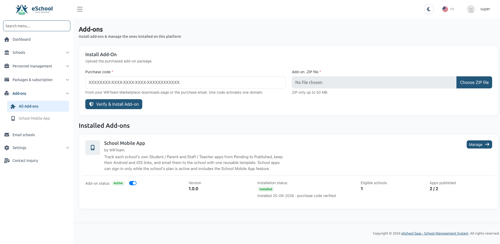

# Add-on Modules

### Add-on Module Feature Guide

> **Module Path:** Super Admin Panel &rarr; **Add-ons** (`/addon-modules`)  
> **Required Role / Permission:** `Super Admin` (System Owner)  
> **System Location:** Server-level module system (`Modules/*`)



---

## Table of Contents

1. [Overview & Architecture](#1-overview--architecture)
   - [What are Add-on Modules?](#what-are-add-on-modules)
   - [Difference Between Add-on Modules and Package Addons](#difference-between-add-on-modules-and-package-addons)
2. [How the Add-on System Works](#2-how-the-add-on-system-works)
   - [Two-Stage Safe Installation Process](#two-stage-safe-installation-process)
   - [Automatic Rollback & Self-Healing](#automatic-rollback--self-healing)
   - [License Verification](#license-verification)
3. [Step-by-Step: Installing an Add-on Module](#3-step-by-step-installing-an-add-on-module)
   - [Prerequisites](#prerequisites)
   - [Navigating to the Add-ons Page](#navigating-to-the-add-ons-page)
   - [Uploading & Verifying the Package](#uploading--verifying-the-package)
   - [The 7-Step Automated Installation Sequence](#the-7-step-automated-installation-sequence)
4. [Managing Installed Add-ons](#4-managing-installed-add-ons)
   - [Understanding Add-on Cards & Details](#understanding-add-on-cards--details)
   - [Activating & Deactivating Add-ons](#activating--deactivating-add-ons)
   - [Handling Incomplete or Failed Installations](#handling-incomplete-or-failed-installations)
   - [Accessing the Add-on Management Panel](#accessing-the-add-on-management-panel)
5. [Server Requirements & Directory Permissions](#5-server-requirements--directory-permissions)
   - [PHP Upload Limits](#php-upload-limits)
   - [Working Directories & Permissions](#working-directories--permissions)
6. [Troubleshooting & Frequently Asked Questions (FAQ)](#6-troubleshooting--frequently-asked-questions-faq)

---

## 1. Overview & Architecture {#1-overview--architecture}

### What are Add-on Modules? {#what-are-add-on-modules}

The **Add-on Module System** in eSchool SaaS provides a robust, pluggable architecture. It enables the Super Administrator to expand the platform's core capabilities by uploading modular code packages (`.zip`) directly from the web interface.

Each add-on module:
- Lives in its own isolated directory under `/Modules/<ModuleName>/`.
- Has its own routes, controllers, views, database migrations, and service providers.
- Can be independently enabled, disabled, or updated without touching or risking core application files.
- Is verified against the official WRTeam license server before installation.

```text
+-----------------------------------------------------------------------------------+
|                            eSchool SaaS Super Admin                               |
|                  Super Admin Panel -> Add-ons (/addon-modules)                    |
+-----------------------------------------+-----------------------------------------+
                                          |
                                          v
+-----------------------------------------------------------------------------------+
|                               Add-on Architecture                                 |
+-----------------------------------------------------------------------------------+
|  1. AddonInstallerService     -> Inspects, verifies license, stages & migrates    |
|  2. AddonRegistry             -> Boots active descriptors & status listeners      |
|  3. AddonCatalogService       -> Manages installed modules & UI cards             |
+-----------------------------------------+-----------------------------------------+
                                          |
                +-------------------------+-------------------------+
                |                                                   |
                v                                                   v
    +-----------------------+                           +-----------------------+
    | Modules/<AddonNameA>  |                           | Modules/<AddonNameB>  |
    | (Installed Module A)  |                           | (Installed Module B)  |
    +-----------------------+                           +-----------------------+
```

---

### Difference Between Add-on Modules and Package Addons {#difference-between-add-on-modules-and-package-addons}

To avoid confusion, note the fundamental difference between the two concepts in eSchool SaaS:

| Feature | Add-on Modules (`/addon-modules`) | Package & Subscription Addons (`/package/addons`) |
| :--- | :--- | :--- |
| **What It Is** | Physical **code packages** (`Modules/*`) installed on the server. | **Commercial billing addons** configured by the Super Admin to sell features to schools. |
| **Target Audience** | **Platform Owner (Super Admin)**. | **School Tenants (School Admins)**. |
| **Purpose** | Adds new system-wide capabilities, APIs, and administrative modules to the platform. | Allows schools to purchase optional subscription features (e.g. extra student capacity, specific core modules). |
| **Installation** | Requires uploading a verified `.zip` package with a purchase code. | Configured directly in the database via the Super Admin subscription package manager. |

---

## 2. How the Add-on System Works {#2-how-the-add-on-system-works}

### Two-Stage Safe Installation Process {#two-stage-safe-installation-process}

Installing code on a production server must never break running services. eSchool SaaS splits the installation into two distinct HTTP requests:

1. **Stage Request (`POST /addon-modules/install`)**:
   - Receives the uploaded `.zip` and purchase code.
   - Unpacks the archive into a temporary sandbox folder (`Modules/.staging/<uuid>`).
   - Verifies the package manifest (`module.json`), composer requirements, file safety, and license.
   - Backs up the existing version (if updating).
   - Atomically swaps the module files into `/Modules/<ModuleName>/` while keeping the module **disabled**.

2. **Finish Request (`POST /addon-modules/install/{key}/finish`)**:
   - Executes in a clean PHP process where stale in-memory classes are not loaded.
   - Clears application caches (`config:clear`, `route:clear`, `view:clear`).
   - Runs database migrations specific to the module (`Modules/<ModuleName>/Database/Migrations`).
   - Runs the add-on's dedicated installer class (e.g., seeding default templates and features).
   - Activates the module in `storage/app/modules_statuses.json`.
   - Records the installation in the `addon_installations` database table.

---

### Automatic Rollback & Self-Healing {#automatic-rollback--self-healing}

If any step fails during the `finish` stage (such as a database query failure or syntax error):
- **Automatic Rollback:** Newly created migrations are rolled back immediately.
- **File Restoration:** If updating, the previous working version is automatically restored from `Modules/.backups/<key>/`. If a fresh install fails, problematic files are moved into `Modules/.failed/` for inspection.
- **Zero Downtime:** The platform remains completely stable, and the active state of the rest of the SaaS is unaffected.

---

### License Verification {#license-verification}

Before any add-on code is placed on the server, eSchool SaaS contacts the official WRTeam validation gateway.

The verification verifies:
1. **Purchase Code Authenticity:** Verifies that the purchase code is valid and issued for the specific add-on.
2. **Domain Binding:** Validates that the purchase code is registered to the active eSchool SaaS domain.
3. **Package Integrity:** Verifies the package against official release builds to prevent tampered or corrupted files from being installed.

---

## 3. Step-by-Step: Installing an Add-on Module {#3-step-by-step-installing-an-add-on-module}

### Prerequisites {#prerequisites}

Before uploading an add-on, make sure:
- You are logged in with the **Super Admin** role.
- You have purchased the add-on from the **WRTeam Marketplace**.
- You have your **Purchase Code** (received via email or found under your marketplace Downloads page).
- Your server meets the minimum upload limits (recommended: `upload_max_filesize = 50M`, `post_max_size = 50M`).
- Outbound HTTPS connectivity from your server is active (cURL enabled) to communicate with the license server.

:::info Demo Mode Protection
The Add-on installation form is automatically disabled on public demo installations to protect the server environment.
:::

---

### Navigating to the Add-ons Page {#navigating-to-the-add-ons-page}

1. Log in to the **Super Admin Panel**.
2. In the left navigation sidebar, click **Add-ons**.
3. The page displays the **Install Add-on** card at the top, followed by the **Installed Add-ons** list below.

---

### Uploading & Verifying the Package {#uploading--verifying-the-package}

1. In the **Purchase Code** field, enter your valid license purchase code (format: `XXXXXXXX-XXXX-XXXX-XXXX-XXXXXXXXXXXX`).
2. In the **Add-on ZIP File** field, click **Choose ZIP File** and select the official `.zip` file of the add-on.
3. Click **Verify & Install Add-on**.

---

### The 7-Step Automated Installation Sequence {#the-7-step-automated-installation-sequence}

Once you click install, an interactive step-by-step progress checklist appears on the screen:

```text
[✓] Package uploaded
[✓] Package structure valid
[✓] Compatible with this server
[✓] Purchase code verified
[✓] Files installed in Modules
[✓] Database updated
[✓] Add-on registered
```

| Step | Technical Name | What Happens Behind the Scenes |
| :---: | :--- | :--- |
| **1** | `upload` | The `.zip` file is safely uploaded to `storage/app/addons/uploads/` and checked against size limits. |
| **2** | `package` | The archive is inspected in memory. It verifies `module.json`, verifies PSR-4 autoloading in `composer.json`, and blocks unauthorized file formats (e.g. `.exe`, `.bat`, `.sh`, `.phar`, `.env`). |
| **3** | `compatibility` | Checks compatibility constraints declared in `module.json` (Core version, PHP version, and required PHP extensions). |
| **4** | `license` | Communicates with the WRTeam license server, validating the purchase code, domain, and file integrity. |
| **5** | `files` | Files are atomically extracted into `/Modules/<ModuleName>/`. Existing files (if updating) are backed up. |
| **6** | `database` | Runs database migrations for the module and executes the custom installer class (seeding necessary tables and settings). |
| **7** | `register` | The module is registered with Laravel, marked `true` in `modules_statuses.json`, and the system cache is rebuilt. |

When finished, a green success message appears, and the page automatically refreshes to display the newly installed add-on.

---

## 4. Managing Installed Add-ons {#4-managing-installed-add-ons}

### Understanding Add-on Cards & Details {#understanding-add-on-cards--details}

Every installed add-on is represented as an informative card containing:

- **Icon & Title:** The branding icon and official title of the add-on.
- **Vendor:** Name of the developer or organization (e.g., `by WRTeam.`).
- **Description:** Summary of what the add-on does.
- **Version:** The currently installed release version (e.g., `1.0.0`).
- **Installation Status Badge:**
  - <span className="badge badge--success badge-success">Installed</span>: The add-on is fully installed and operational.
  - <span className="badge badge--warning badge-warning">Setup incomplete</span>: The package was uploaded and staged, but the database step has not completed.
  - <span className="badge badge--danger badge-danger">Not loaded</span>: The module files exist, but the module is switched off in `modules_statuses.json`.
  - <span className="badge badge--danger badge-danger">Files missing</span>: An installation record exists in the database, but the physical folder in `/Modules/` cannot be found.
- **Verification Note:** Shows the date installed and confirms that the purchase code is verified on record.

---

### Activating & Deactivating Add-ons {#activating--deactivating-add-ons}

Each add-on card includes an **Add-on Status** switch (**Active / Inactive**):

1. **Setting to Inactive:**
   - Toggle the switch to off.
   - If the add-on defines a deactivation notice, a confirmation modal will display explaining the impact.
   - Confirming turns off the module's routes, menus, and background event listeners.
   - **Data is NOT deleted:** Disabling an add-on preserves all database records, settings, and associations.
2. **Setting to Active:**
   - Toggle the switch to on.
   - The module's routes, permissions, and navigation menus are immediately re-enabled.

---

### Handling Incomplete or Failed Installations {#handling-incomplete-or-failed-installations}

If an installation is interrupted (for example, server timeout during migration or network disconnect):

1. The card displays a yellow <span className="badge badge--warning badge-warning">Setup incomplete</span> badge.
2. The last known error message is displayed in a warning banner.
3. Two action buttons become available:
   - **Finish installation:** Retries the database migration and registration step.
   - **Cancel:** Removes the newly staged files and cleanly restores the previous version (if updating) or removes the staged files completely.

---

### Accessing the Add-on Management Panel {#accessing-the-add-on-management-panel}

When an add-on is **Active** and provides a Super Admin management interface, a **Manage &rarr;** button appears on the right side of the card. Clicking this button takes you directly to the add-on’s main control panel (or you can use the newly added menu item in the left sidebar).

:::tip Inactive Add-ons
If an add-on is set to **Inactive**, the **Manage** button is disabled with a tooltip reminding you to activate the add-on first.
:::

---

## 5. Server Requirements & Directory Permissions {#5-server-requirements--directory-permissions}

### PHP Upload Limits {#php-upload-limits}

Because add-on modules contain source code, templates, and compiled assets, ensure your `php.ini` file accommodates file uploads:

```ini
; Recommended settings in /etc/php/8.2/fpm/php.ini (or equivalent)
upload_max_filesize = 50M
post_max_size = 50M
max_execution_time = 300
memory_limit = 256M
```

After modifying `php.ini`, restart your web server or PHP-FPM service:
```bash
sudo systemctl restart php8.2-fpm
sudo systemctl restart nginx # or apache2
```

---

### Working Directories & Permissions {#working-directories--permissions}

Ensure the following directories exist and are writable by the web server user (`www-data` or `apache`):

| Directory | Purpose | Permissions |
| :--- | :--- | :--- |
| `Modules/` | Permanent location of all installed module directories | `775` (writable) |
| `Modules/.staging/` | Temporary sandbox for extracting and validating ZIP packages | `775` (writable) |
| `Modules/.backups/` | Automated backup copies created prior to upgrading an add-on | `775` (writable) |
| `Modules/.failed/` | Stores files of failed installations for debugging | `775` (writable) |
| `storage/app/addons/uploads/` | Stores raw uploaded ZIP files during processing | `775` (writable) |

---

## 6. Troubleshooting & Frequently Asked Questions (FAQ) {#6-troubleshooting--frequently-asked-questions-faq}

### Q1: The installer says: *"The add-on ZIP may not be larger than X KB."*
**Cause:** The ZIP file exceeds the limit defined in PHP's `upload_max_filesize` or `post_max_size`.  
**Fix:** Increase `upload_max_filesize` and `post_max_size` to `50M` in your `php.ini`, restart PHP-FPM / Apache, and retry.

---

### Q2: Error: *"Could not reach the add-on license server."*
**Cause:** Your web server cannot establish an outbound HTTPS connection to the license verification server.  
**Fix:** 
1. Check that cURL is enabled: `php -m | grep curl`.
2. Verify outbound network connectivity from your server.
3. Ensure server firewalls (UFW, iptables, Cloudflare Tunnel, or AWS Security Groups) allow outbound port `443` traffic.

---

### Q3: Error: *"This package is not a release the license server knows."*
**Cause:** The uploaded ZIP file has been altered, re-archived, or corrupted.  
**Fix:** Download the clean, original `.zip` package directly from your marketplace Downloads page and upload it without extracting or re-compressing it.

---

### Q4: Error: *"Another add-on installation is running. Try again in a few minutes."*
**Cause:** A previous upload was aborted or interrupted, leaving an active cache lock.  
**Fix:** The lock expires automatically after 15 minutes. To clear it immediately, run:
```bash
php artisan cache:clear
```

---

### Q5: Can I manually enable or disable an add-on from the terminal?
**Answer:** Yes. The platform uses standard Laravel Modules commands:
```bash
# List all modules and their statuses
php artisan module:list

# Enable an installed module
php artisan module:enable <ModuleName>

# Disable an installed module
php artisan module:disable <ModuleName>

# Clear framework caches
php artisan optimize:clear
```
