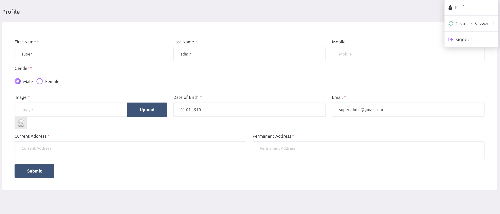

# Authentication

:::tip Prefer to watch?
The [Profile video tutorial](/tutorials/super-admin/profile/) shows how to update your profile details and change your password, step by step.
:::

Default email and password of super admin is superadmin@gmail.com and superadmin. This can be changed later. 