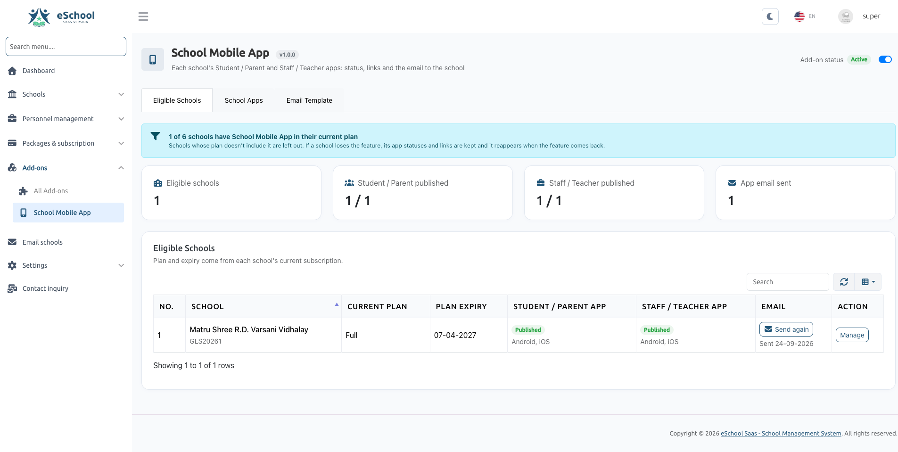
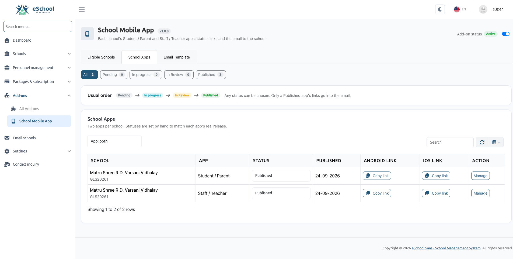
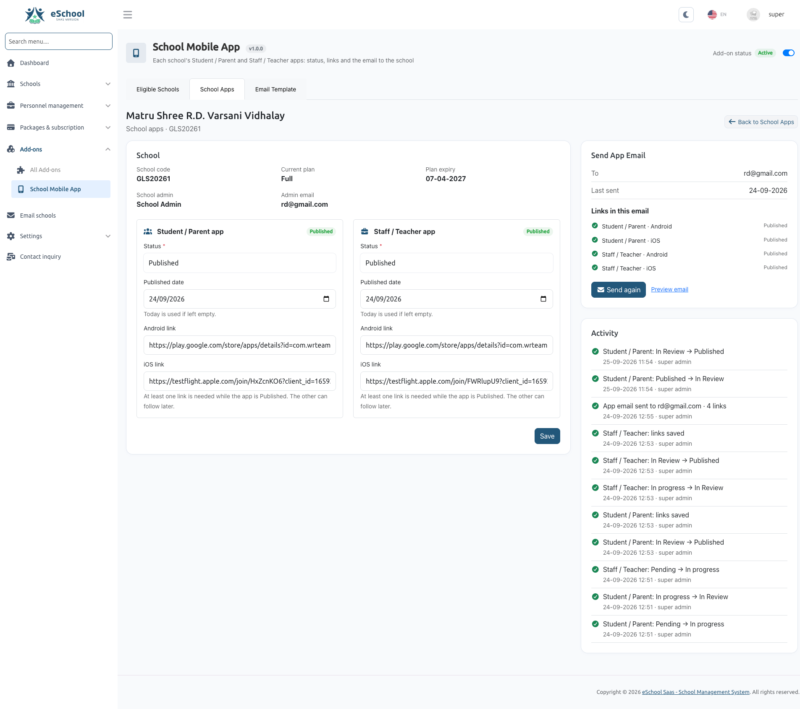
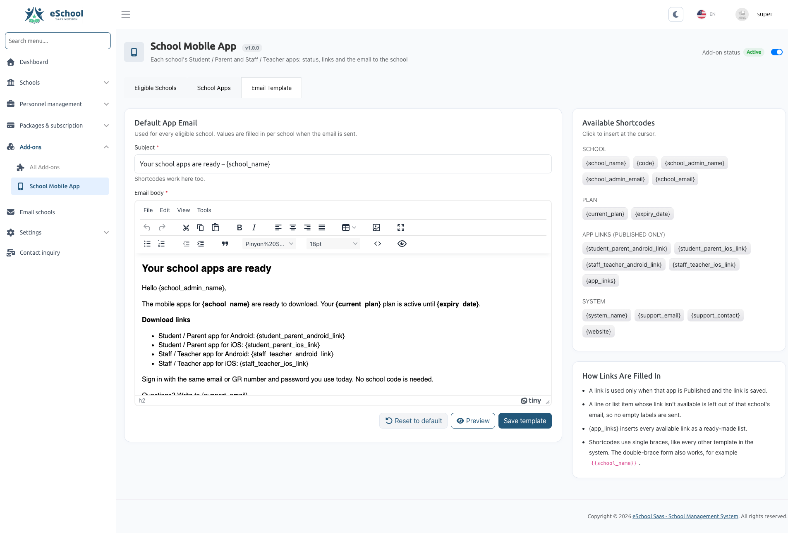

# School Mobile App Add-on

### Official Feature & Administration Guide

> **Module Path:** Super Admin Panel &rarr; **School Mobile App** (`/addons/school-mobile-app`)  
> **Parent Module:** Add-ons (`/addon-modules`)  
> **Required Permission:** `sma-school-apps-list` (or `Super Admin` role)  
> **System Location:** `/Modules/SchoolMobileApp/`



---

## Table of Contents

1. [Overview & Architecture](#1-overview--architecture)
   - [What is the School Mobile App Add-on?](#what-is-the-school-mobile-app-add-on)
   - [Two Distinct Apps Per School](#two-distinct-apps-per-school)
   - [Core Workflow Summary](#core-workflow-summary)
2. [Prerequisites & System Requirements](#2-prerequisites--system-requirements)
3. [Step-by-Step Installation](#3-step-by-step-installation)
   - [Installing via the Add-ons Manager](#installing-via-the-add-ons-manager)
   - [What the Installer Sets Up](#what-the-installer-sets-up)
   - [Enabling the Add-on](#enabling-the-add-on)
4. [Packaging & School Eligibility](#4-packaging--school-eligibility)
   - [The "School Mobile App" Feature (ID: 100000)](#the-school-mobile-app-feature-id-100000)
   - [Enabling Mobile Apps in Subscription Packages](#enabling-mobile-apps-in-subscription-packages)
   - [Eligibility Criteria & Automatic Synchronization](#eligibility-criteria--automatic-synchronization)
5. [Managing School Mobile Apps](#5-managing-school-mobile-apps)
   - [Tab 1: Eligible Schools Dashboard](#tab-1-eligible-schools-dashboard)
   - [Tab 2: Master School Apps List](#tab-2-master-school-apps-list)
   - [Managing a School: Statuses, Dates & Store Links](#managing-a-school-statuses-dates--store-links)
   - [App Lifecycle Statuses](#app-lifecycle-statuses)
   - [Activity Audit Trail](#activity-audit-trail)
6. [Email Notification System & Template](#6-email-notification-system--template)
   - [Tab 3: Email Template Editor](#tab-3-email-template-editor)
   - [Available Shortcodes Reference](#available-shortcodes-reference)
   - [Smart Link Filtering (No Broken Placeholders)](#smart-link-filtering-no-broken-placeholders)
   - [Live Template Preview](#live-template-preview)
   - [Sending the App Links to School Admin](#sending-the-app-links-to-school-admin)
7. [API Gatekeeping & Mobile App Integration](#7-api-gatekeeping--mobile-app-integration)
   - [How Custom Apps Authenticate (`X-App-Type`)](#how-custom-apps-authenticate-x-app-type)
   - [Login Guard Verification Sequence](#login-guard-verification-sequence)
   - [Error Codes & Client Responses](#error-codes--client-responses)
   - [Continuous Token Validation](#continuous-token-validation)
8. [Permissions & Staff Access](#8-permissions--staff-access)
9. [Troubleshooting & Frequently Asked Questions (FAQ)](#9-troubleshooting--frequently-asked-questions-faq)

---

## 1. Overview & Architecture {#1-overview--architecture}

### What is the School Mobile App Add-on? {#what-is-the-school-mobile-app-add-on}

The **School Mobile App Add-on** is a premium extension for eSchool SaaS that allows the SaaS owner to provide **custom-branded, white-label mobile applications** to schools.

Instead of all schools sharing a single generic mobile app, subscribing schools can have their own individually branded applications published directly on the **Google Play Store (Android)** and **Apple App Store (iOS)** with their school name, logo, splash screen, and colors.

```text
+-----------------------------------------------------------------------------------+
|                            eSchool SaaS Super Admin                               |
|             Super Admin Panel -> School Mobile App (/addons/school-mobile-app)    |
+-----------------------------------------+-----------------------------------------+
                                          |
                +-------------------------+-------------------------+
                |                                                   |
                v                                                   v
   +--------------------------+                        +--------------------------+
   |  Student / Parent App    |                        |   Staff / Teacher App    |
   | (Google Play + App Store)|                        | (Google Play + App Store)|
   +--------------------------+                        +--------------------------+
                |                                                   |
                +-------------------------+-------------------------+
                                          |
                                          v
                      +---------------------------------------+
                      |       X-App-Type: school-specific     |
                      |   - Verifies School Code              |
                      |   - Verifies Active Subscription Plan |
                      |   - Verifies Feature in Plan          |
                      +---------------------------------------+
```

---

### Two Distinct Apps Per School {#two-distinct-apps-per-school}

Each eligible school can have up to **two independent apps** across both mobile platforms (up to 4 store URLs per school):

1. **Student / Parent Mobile App:**
   - Dedicated for students and guardians.
   - Supports homework submissions, attendance tracking, fee payments, timetables, and report cards.
   - Independent Android & iOS store links.
2. **Staff / Teacher Mobile App:**
   - Dedicated for teachers, principals, and school administrative personnel.
   - Supports attendance taking, grading assignments, student leave approvals, and exam management.
   - Independent Android & iOS store links.

---

### Core Workflow Summary {#core-workflow-summary}

```text
[ Super Admin ]   Creates Subscription Package with "School Mobile App" Feature
       │
       ▼
[ School Admin ]  Subscribes to the package / addon
       │
       ▼
[ Eligible List ] School automatically appears under "Eligible Schools"
       │
       ▼
[ App Dev Team ]  Builds, brands, and submits the custom apps to Google/Apple stores
       │
       ▼
[ Super Admin ]   Updates App Status (Pending -> In Progress -> In Review -> Published)
       │          and saves the published Android & iOS URLs
       ▼
[ Email Delivery] Super Admin clicks "Send App Link", delivering a customized email
                  with ready-to-click download links directly to the School Admin
       │
       ▼
[ Login Guard ]   School app users log in. The backend validates subscription health
                  and grants secure access via "X-App-Type: school-specific"
```

---

## 2. Prerequisites & System Requirements {#2-prerequisites--system-requirements}

Before installing and utilizing this add-on, ensure:

- **eSchool SaaS Core:** Version **v1.12.0** or later.
- **PHP Version:** PHP **8.2** or higher.
- **Add-on ZIP File:** Official `SchoolMobileApp.zip` package from WRTeam Marketplace.
- **Purchase Code:** Valid marketplace purchase code for the School Mobile App add-on.
- **Email (SMTP) Setup:** An active SMTP configuration under **Super Admin &rarr; Settings &rarr; Email Configuration** to enable automated email delivery to school administrators.

---

## 3. Step-by-Step Installation {#3-step-by-step-installation}

### Installing via the Add-ons Manager {#installing-via-the-add-ons-manager}

1. Log in to the **Super Admin Panel**.
2. Navigate to **Add-ons** in the left sidebar menu (`/addon-modules`).
3. Locate the **Install Add-on** section at the top of the page.
4. Enter your **Purchase Code** in the field provided.
5. Click **Choose ZIP File** and select `SchoolMobileApp.zip`.
6. Click **Verify & Install Add-on**.
7. The automated installer will execute the 7 verification and staging steps (validating package files, server compatibility, license, database migrations, and module registration).
8. Once completed, a confirmation toast notification will appear, and the page will refresh.

---

### What the Installer Sets Up {#what-the-installer-sets-up}

When `SchoolMobileApp` installs, it automatically executes its internal setup:

- **Database Tables:**
  - `sma_school_apps`: Stores app lifecycle statuses, published dates, Android URLs, and iOS URLs.
  - `sma_school_app_activities`: Maintains an immutable audit trail of status updates, link changes, and email dispatches.
- **System Feature:** Registers the **School Mobile App** feature (Fixed Feature ID: `100000`) in the core `features` table.
- **Default Settings:** Seeds default values for `school_mobile_app_status`, `sma_app_email_subject`, and `sma_app_email_template` into `system_settings`.
- **System Permissions:** Registers permissions (`sma-school-apps-list`, `sma-school-apps-edit`, `sma-school-apps-notify`, `sma-email-template-edit`, `sma-addon-status`) and grants them to the Super Admin role.

---

### Enabling the Add-on {#enabling-the-add-on}

1. On the **Add-ons** page, find the **School Mobile App** card.
2. Toggle the **Add-on Status** switch to **Active**.
3. A new menu item titled **School Mobile App** will immediately appear in your Super Admin navigation sidebar.

:::tip Disabling the Add-on
If the add-on is set to **Inactive**, its administrative routes and menus are hidden, and custom school app logins will be temporarily rejected with `SCHOOL_APP_UNAVAILABLE`. All recorded store links, settings, and activity histories remain safely preserved in the database.
:::

---

## 4. Packaging & School Eligibility {#4-packaging--school-eligibility}

### The "School Mobile App" Feature (ID: 100000) {#the-school-mobile-app-feature-id-100000}

The installer registers a dedicated feature named **School Mobile App** (Feature ID `100000`). Because it is registered in the main `features` table, it works identically to core platform features:
- It can be included in subscription packages.
- It can be offered as a standalone Feature Add-on.

---

### Enabling Mobile Apps in Subscription Packages {#enabling-mobile-apps-in-subscription-packages}

To offer branded mobile apps to schools:

1. In the Super Admin Panel, go to **Package & Subscription** &rarr; **Package**.
2. Click **Create Package** (or edit an existing enterprise/premium package).
3. Under the **Features** checklist, check the box for **School Mobile App**.
4. Set your package pricing, billing frequency, and student capacity, then click **Save**.

*Alternatively (Feature Addon):*
1. Go to **Package & Subscription** &rarr; **Addon**.
2. Create an addon containing the **School Mobile App** feature so schools can purchase it as an add-on to their existing subscription.

---

### Eligibility Criteria & Automatic Synchronization {#eligibility-criteria--automatic-synchronization}

A school is automatically recognized as **Eligible** if:
1. The school has a non-cancelled, date-active subscription plan containing Feature ID `100000`.
2. The school does not have an **overdue postpaid billing invoice**.

> **Automatic Sync:** You never need to manually "add" schools to the mobile app dashboard. When a school purchases or renews an eligible plan, it appears under **Eligible Schools** automatically. If a school's plan expires, it is automatically marked ineligible.

---

## 5. Managing School Mobile Apps {#5-managing-school-mobile-apps}

Navigate to **Super Admin Panel &rarr; School Mobile App** (`/addons/school-mobile-app`). The interface is divided into three functional tabs:

---

### Tab 1: Eligible Schools Dashboard {#tab-1-eligible-schools-dashboard}

The **Eligible Schools** tab (`/addons/school-mobile-app`) provides an executive overview and a searchable table of qualifying schools.


#### Dashboard KPI Cards:
- **Eligible Schools:** Total number of schools currently subscribed to the School Mobile App feature.
- **Student / Parent Apps Published:** Count of schools with live Student/Parent apps.
- **Staff / Teacher Apps Published:** Count of schools with live Staff/Teacher apps.
- **App Emails Sent:** Total number of schools that have been emailed their official download links.

#### Data Columns in the Table:
| Column | Description |
| :--- | :--- |
| **School** | School name and school identification code. |
| **Current Plan** | Name of the active subscription package. |
| **Plan Expiry** | End date of the current subscription. |
| **Student / Parent** | Status badge and platform indicators (e.g. *Published (Android, iOS)*). |
| **Staff / Teacher** | Status badge and platform indicators. |
| **App Email** | Shows **Send Email** button, or *Last sent: [Date]* with a **Send again** option. |
| **Action** | **Manage** button directing to the school's dedicated app management page. |

---

### Tab 2: Master School Apps List {#tab-2-master-school-apps-list}

The **School Apps** tab (`/addons/school-mobile-app/school-apps`) gives your technical and operations team an app-by-app view.



- **Filter by App Type:** Show All, Student / Parent, or Staff / Teacher apps.
- **Filter by Lifecycle Status:** View counts and filter by `Pending`, `In Progress`, `In Review`, or `Published`.
- **Search Bar:** Quickly look up apps by school name or school code.
- **Include Ineligible Schools:** A checkbox toggle allowing you to review and manage schools whose subscriptions have lapsed, ensuring past records and URLs are never lost.

---

### Managing a School: Statuses, Dates & Store Links {#managing-a-school-statuses-dates--store-links}

Clicking **Manage** on any school opens its management interface (`/addons/school-mobile-app/schools/{id}`):



```text
+-----------------------------------------------------------------------------------+
|  Oakridge International Academy (Code: OAK-01)                                    |
|  Current Plan: Platinum Annual | Expiry: 15 Oct, 2026 | Admin: john@oakridge.edu   |
+-----------------------------------------------------------------------------------+
|                                                                                   |
|  [ Student / Parent App ]                     [ Staff / Teacher App ]             |
|  Status: [ Published           v ]            Status: [ In Progress         v ]   |
|                                                                                   |
|  Published Date:                              (Published date and store link      |
|  [ 2026-10-01 ]                               inputs unlock automatically when    |
|                                                the status is set to Published)    |
|  Android Link (Google Play):                                                      |
|  [ https://play.google.com/store/apps/... ]                                       |
|                                                                                   |
|  iOS Link (Apple App Store):                                                      |
|  [ https://apps.apple.com/app/id...       ]                                       |
|                                                                                   |
|                               [ Save Changes ]                                    |
+-----------------------------------------------------------------------------------+
```

#### Step-by-Step Configuration:
1. In the **Status** dropdown for either app, select the current development state.
2. When you set the status to **Published**:
   - The **Published Date** field unlocks (defaults to today's date).
   - The **Android Link** and **iOS Link** input fields unlock.
   - Enter the full store URL (e.g., `https://play.google.com/store/apps/details?id=com.oakridge.student`).
3. Click **Save**.

:::note Flexible Publishing
At least **one link** (Android or iOS) is required when an app is marked Published. If Apple App Store review takes longer than Google Play Store, you can publish with the Android link first and add the iOS link later.
:::

---

### App Lifecycle Statuses {#app-lifecycle-statuses}

| Status | Badge Color | Meaning & System Behavior |
| :--- | :--- | :--- |
| **Pending** | <span className="badge badge--secondary badge-secondary">Pending</span> | Initial default status. School has subscribed, but build has not started. Store link inputs are locked. |
| **In Progress** | <span className="badge badge--info badge-info">In Progress</span> | Development team is preparing graphic assets, branding, and compiling the APK / IPA binaries. |
| **In Review** | <span className="badge badge--warning badge-warning">In Review</span> | App binaries have been submitted to Google Play Console or Apple App Store Connect and are awaiting approval. |
| **Published** | <span className="badge badge--success badge-success">Published</span> | App is approved and available for public download. Unlocks published date, Android URL, and iOS URL. |

---

### Activity Audit Trail {#activity-audit-trail}

On the right side of the school management page, the **Activity** feed records all historical actions:
- Status changes (e.g. *Student / Parent: In Review &rarr; Published*).
- Store link updates.
- Email dispatch logs with recipient email, timestamp, and administrator name.
- Email delivery errors (e.g. invalid SMTP credentials).

---

## 6. Email Notification System & Template {#6-email-notification-system--template}

### Tab 3: Email Template Editor {#tab-3-email-template-editor}

Under the **Email Template** tab (`/addons/school-mobile-app/email-template`), administrators can customize the email sent to school administrators when their apps are ready.



- **Subject Line:** Supports plain text and dynamic shortcodes.
- **TinyMCE Rich Text Editor:** Format typography, add logos, bold text, bulleted lists, and tables.
- **One-Click Tag Insertion:** Click any badge under "Available Tags" to insert the shortcode at your cursor.
- **Reset to Default:** Reverts the subject and body to the original system template.

---

### Available Shortcodes Reference {#available-shortcodes-reference}

| Shortcode Tag | Description | Sample Output |
| :--- | :--- | :--- |
| `{school_name}` | Name of the school | Oakridge International Academy |
| `{code}` | School code | OAK-01 |
| `{school_admin_name}` | Name of the school administrator user | John Doe |
| `{school_admin_email}` | Email address of the school administrator | admin@oakridge.edu |
| `{school_email}` | School contact email | contact@oakridge.edu |
| `{current_plan}` | Name of current subscription plan | Platinum Annual Plan |
| `{expiry_date}` | Plan expiration date | 15 Oct, 2026 |
| `{student_parent_android_link}` | Google Play link for Student/Parent app | `https://play.google.com/...` |
| `{student_parent_ios_link}` | App Store link for Student/Parent app | `https://apps.apple.com/...` |
| `{staff_teacher_android_link}` | Google Play link for Staff/Teacher app | `https://play.google.com/...` |
| `{staff_teacher_ios_link}` | App Store link for Staff/Teacher app | `https://apps.apple.com/...` |
| `{app_links}` | Formatted list of all available published links | *(Bulleted HTML list of links)* |
| `{system_name}` | Name of your SaaS platform | eSchool SaaS |
| `{support_email}` | Platform support email | support@yourdomain.com |
| `{support_contact}` | Platform support contact number | +1 555-0199 |
| `{website}` | Platform website URL | https://yourdomain.com |

---

### Smart Link Filtering (No Broken Placeholders) {#smart-link-filtering-no-broken-placeholders}

The email engine includes an intelligent DOM filter:
- If your template contains:
  ```html
  <li>Student App (iOS): {student_parent_ios_link}</li>
  ```
  ...and the school's iOS app has **not yet been published**, the template engine automatically removes the entire `<li>` element.
- The school administrator receives a clean, professional email containing **only** the apps that are actually live and downloadable.

---

### Live Template Preview {#live-template-preview}

1. On the **Email Template** page, click the **Preview** button (or navigate via the "Preview Email" link on any school's page).
2. Select any eligible school from the dropdown.
3. The preview modal renders the exact email using the school's real data, highlighting which store links will be included and which are omitted.

---

### Sending the App Links to School Admin {#sending-the-app-links-to-school-admin}

1. Open the school's manage page or click **Send email** from the Eligible Schools list.
2. The sidebar displays:
   - Recipient admin email.
   - Last sent date (or *Never*).
   - Checklist showing available links that will be included in the message.
3. Click **Send App Link to School Admin**.
4. The system sends the email via your configured SMTP service and logs the event in the Activity feed.

:::info Button Requirements
The **Send Email** button is automatically enabled only when the school is eligible and **at least one app is Published** with a valid URL.
:::

---

## 7. API Gatekeeping & Mobile App Integration {#7-api-gatekeeping--mobile-app-integration}

### How Custom Apps Authenticate (`X-App-Type`) {#how-custom-apps-authenticate-x-app-type}

When mobile developers build the custom-branded Flutter applications for each school, they embed the school's unique code and configure the HTTP client to send an identification header on all login requests:

```http
POST /api/student/login HTTP/1.1
Host: your-eschool-saas.com
Content-Type: application/json
X-App-Type: school-specific

{
    "school_code": "OAK-01",
    "email": "student@oakridge.edu",
    "password": "secretpassword"
}
```

- **`X-App-Type: general` (or omitted):** Handled as the generic shared app. Standard authentication without school plan validation.
- **`X-App-Type: school-specific`:** Handled as a custom-branded school app. Triggers the School Mobile App login guard.

---

### Login Guard Verification Sequence {#login-guard-verification-sequence}

When `X-App-Type: school-specific` is received on any login endpoint (`/api/student/login`, `/api/parent/login`, `/api/teacher/login`, `/api/staff/login`), the system executes four mandatory checks:

```text
Incoming Login Request
         │
         ▼
[ Check 1: School Exists? ] ────────── No ──▶  Code 118: SCHOOL_NOT_FOUND
         │ Yes
         ▼
[ Check 2: Add-on Active? ] ────────── No ──▶  Code 119: SCHOOL_APP_UNAVAILABLE
         │ Yes
         ▼
[ Check 3: Active Plan? ] ──────────── No ──▶  Code 120/121/122: PLAN_EXPIRED / OVERDUE
         │ Yes
         ▼
[ Check 4: Feature in Plan? ] ──────── No ──▶  Code 123: FEATURE_NOT_AVAILABLE
         │ Yes
         ▼
Standard Credentials Authentication (Email & Password)
```

:::tip Developer Testing Note
The login guard purposefully **does not check** whether the app's status in the admin panel is set to "Published". This allows your mobile app developers and quality assurance testers to test the custom application in real time while the app status remains `In Progress` or `In Review`.
:::

---

### Error Codes & Client Responses {#error-codes--client-responses}

If a validation check fails, the API returns a structured HTTP 200 JSON response with a specific error code so the mobile app can display an informative alert to the user:

| Response Code | Constant | Meaning / User Message |
| :---: | :--- | :--- |
| **`118`** | `SCHOOL_NOT_FOUND` | School not found. Please verify the school code. |
| **`119`** | `SCHOOL_APP_UNAVAILABLE` | School Mobile App is currently unavailable. Please contact the administrator. |
| **`120`** | `PLAN_EXPIRED` | The school's subscription plan has expired. Please contact school administration. |
| **`121`** | `NO_ACTIVE_PLAN` | This school does not have an active subscription plan. |
| **`122`** | `PLAN_PAYMENT_OVERDUE` | Access temporarily suspended due to an overdue subscription bill. |
| **`123`** | `FEATURE_NOT_AVAILABLE` | The School Mobile App feature is not included in this school's current plan. |

---

### Continuous Token Validation {#continuous-token-validation}

When a user signs in through a branded school app:
1. The personal access token is issued with the Sanctum ability `app-type:school-specific`.
2. The `EnsureSchoolAppAccess` middleware checks subsequent API requests against the school's subscription status (cached for 5 minutes).
3. If a school's subscription lapses while students are logged in, active sessions terminate gracefully, prompting users to re-authenticate once the school renews.

---

## 8. Permissions & Staff Access {#8-permissions--staff-access}

The module includes granular permissions for administrative staff:

| Permission Name | Description | Recommended Assignment |
| :--- | :--- | :--- |
| `sma-school-apps-list` | View the Eligible Schools dashboard and School Apps list | Operations, Support, Developers |
| `sma-school-apps-edit` | Update app statuses, published dates, and store URLs | Project Managers, App Developers |
| `sma-school-apps-notify`| Send and re-send the notification email to School Admins | Account Managers, Support Leads |
| `sma-email-template-edit`| Edit, preview, and reset the global email notification template | Super Admin, Communications Lead |
| `sma-addon-status` | Toggle the module Active / Inactive switch | Super Admin only |

> **Super Admin Bypass:** Users assigned the `Super Admin` role automatically bypass permission checks and have full administrative authority over all School Mobile App operations.

---

## 9. Troubleshooting & Frequently Asked Questions (FAQ) {#9-troubleshooting--frequently-asked-questions-faq}

### Q1: Why is a school not appearing in the "Eligible Schools" list?
**Answer:** A school only appears in the list if all the following conditions are met:
1. The school has an active subscription to a package or addon that includes the **School Mobile App** feature (Feature ID `100000`).
2. The subscription `start_date` and `end_date` cover the current date.
3. The school does not have an overdue postpaid subscription invoice (`hasOverdueBill`).

---

### Q2: Can I publish the Android link before the iOS app is approved?
**Answer:** Yes. When setting the status to **Published**, you only need to provide at least one store URL. If the Android app is approved first, enter the Google Play Store link and click **Save**. You can return and paste the Apple App Store link once Apple approves the submission.

---

### Q3: An email was sent, but the iOS link was missing from the message. Why?
**Answer:** The email engine automatically suppresses shortcodes for apps that are not yet **Published** or do not have a saved URL. This prevents students or school admins from receiving emails with blank spaces or non-functioning links. Once you add the iOS link, you can click **Send again**.

---

### Q4: What happens if an eligible school's subscription expires?
**Answer:**
- The school drops off the **Eligible Schools** list.
- Its historical app records and store URLs remain preserved under **School Apps** (accessible by checking the *"Include schools no longer eligible"* filter).
- When users attempt to sign in to the branded mobile app, the login guard returns error code `120 (PLAN_EXPIRED)`.
- As soon as the school renews its subscription, eligibility and app login access are restored immediately.

---

### Q5: Can our mobile developers test the apps before setting the status to "Published"?
**Answer:** Yes. The backend API login guard (`X-App-Type: school-specific`) only verifies that the school is subscribed to an active plan containing the School Mobile App feature. It deliberately does not require the app status to be "Published", allowing developers to build, test, and perform QA testing using `Pending` or `In Progress` statuses.

---

### Q6: Where can I check why an email failed to send?
**Answer:** Open the school's page under **School Mobile App &rarr; School Apps &rarr; Manage**. On the right side, the **Activity** feed displays `App email failed` along with the exact error message returned by your mail server (e.g. *Connection refused* or *Authentication failed*). Ensure your SMTP credentials under **Settings &rarr; Email Configuration** are correct.
