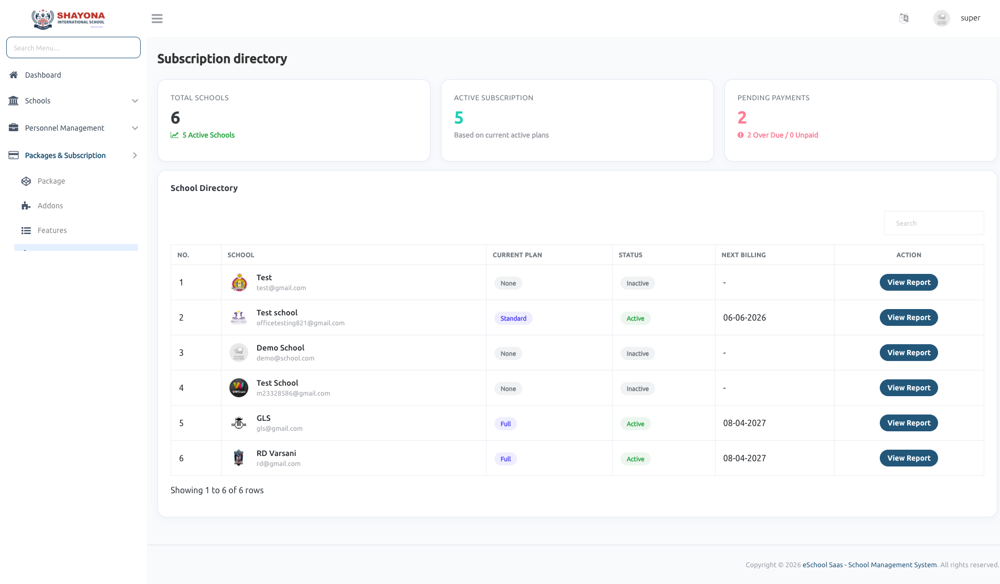
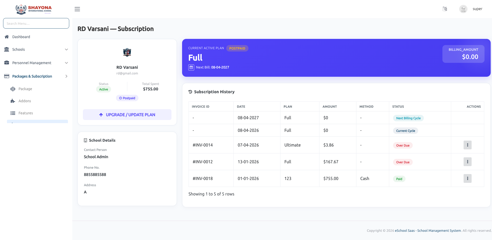

# Subscription

## Subscription Management (Super Admin)
Provides a centralized interface for managing and monitoring subscription details of each school.
* Displays complete overview of the selected school including name, email, status, and total spending.
* Shows current active plan with details such as plan name, billing type (postpaid/prepaid), next billing date, and billing amount.

---

### Plan Management
* Assign a new subscription plan to schools without an active plan.
* Upgrade existing plans.

---

### Billing & Payment Management
* Record and manage payments manually.
* Supports **Cash** and **Cheque** payment methods.
* Tracks invoice details including invoice ID, date, plan, and amount.
* Displays payment status such as **Paid**, **Overdue**, **Current Cycle**, and **Next Billing Cycle**.

---

### Subscription History
* Maintains a complete log of all subscription activities.
* Displays past and current billing cycles.
* Tracks all payment transactions and plan changes.
* Helps in monitoring overdue and upcoming payments.

---

### Receipt & Reporting
* View detailed receipts for completed transactions.

