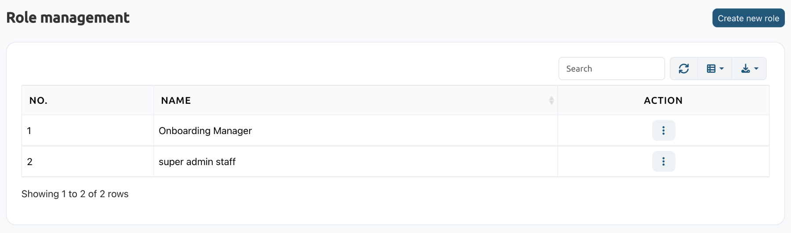
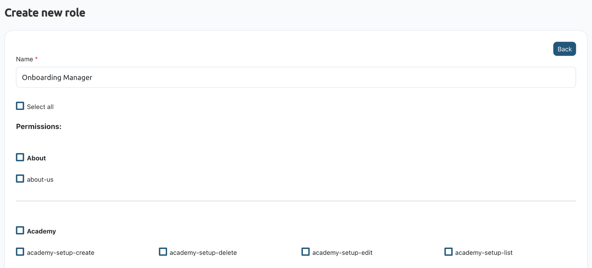
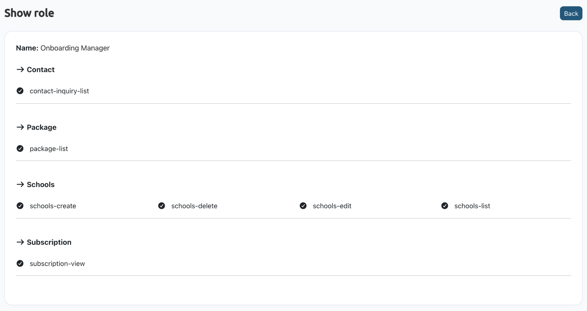

# Role Permissions

:::tip Prefer to watch?
The [Role & permission video tutorial](/tutorials/super-admin/role-permission/) shows how to create, view, edit and delete a role.
:::

## Overview
A role decides what a Super Admin staff member can see and do. Create a role, choose its permissions, then give the role to a staff member in **Personnel management** > **Staff**.

The following roles are reserved and are not listed here: Super Admin, School Admin, Teacher, Guardian, Student.

## Create a role
1. Navigate to **Personnel management** > **Role & permission** and click **Create new role**.
2. Enter a **Name** for the role, for example *Onboarding Manager*.
3. Choose the permissions. They are grouped by module:
   - **Select all** gives every permission.
   - Tick a module's name, for example **Schools**, to give every permission in that module.
   - Tick single permissions, for example **contact-inquiry-list** or **package-list**, to give only those.
4. Click **Submit**. The role appears in the list.

## View, edit or delete a role
Use the **⋮** menu in the role's row:
- **View:** shows the role's name and its permissions, grouped by module.

  

- **Edit:** the role's permissions are already ticked. Add or remove any and click **Submit**.
- **Delete:** click **Yes, delete it** to remove the role, or **Cancel** to keep it. A deleted role can't be restored.
