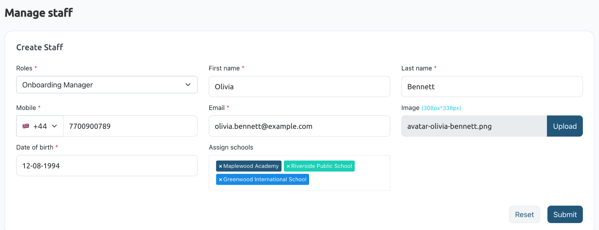
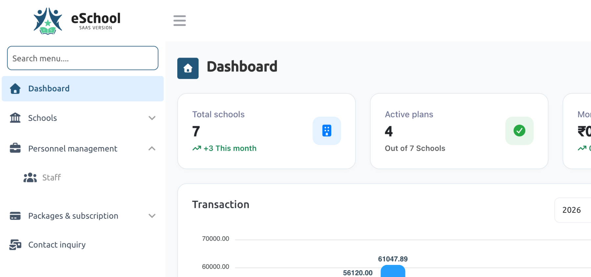

# Staff

:::tip Prefer to watch?
The [Staff video tutorial](/tutorials/super-admin/staff/) shows how to add a staff member and what they see when they sign in.
:::

## Overview
Staff members are people on your team who help you run the platform. Each staff member has a role, which decides what they can see and do. Create roles first in **Personnel management** > [**Role & permission**](./role-permission.md).

## Add a staff member
1. Navigate to **Personnel management** > **Staff**.
2. In **Create Staff**, choose the staff member's **Roles**, for example *Onboarding Manager*.
3. Enter their **First name** and **Last name**.
4. Choose the country code and enter their **Mobile** number.
5. Enter their **Email**. They sign in with it.
6. Optionally, click **Upload** to add their **Image**, which should be 308 × 338 px.
7. Enter their **Date of birth**.
8. In **Assign schools**, pick the schools they look after. Those schools see this staff member's details as their support contact.
9. Click **Submit**.

## Staff sign-in
Staff members sign in on the usual sign-in page with their email address. Their password is their mobile number, without the country code. They leave **School code** empty.

After signing in, their menu shows only what their role allows. For example, an Onboarding Manager with the Schools, contact inquiry, package, subscription and staff permissions sees Schools, Staff, Packages & subscription and Contact inquiry, but not Role & permission, Add-ons, Email schools or Settings.

## Staff list
The **Staff List** under the form shows your staff members. Use **Active** and **Inactive** to switch between active and inactive staff.
