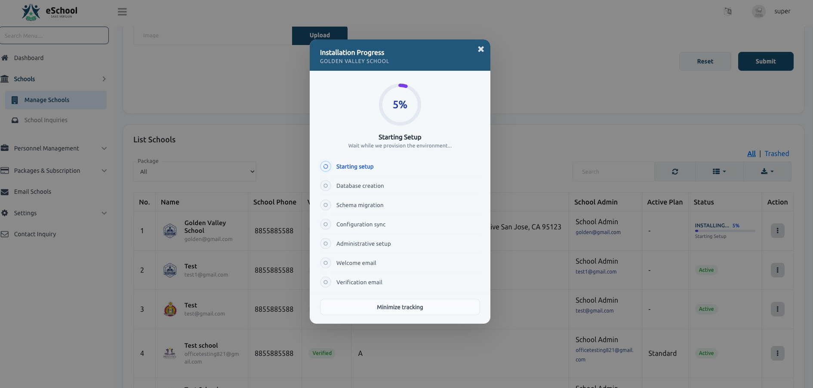
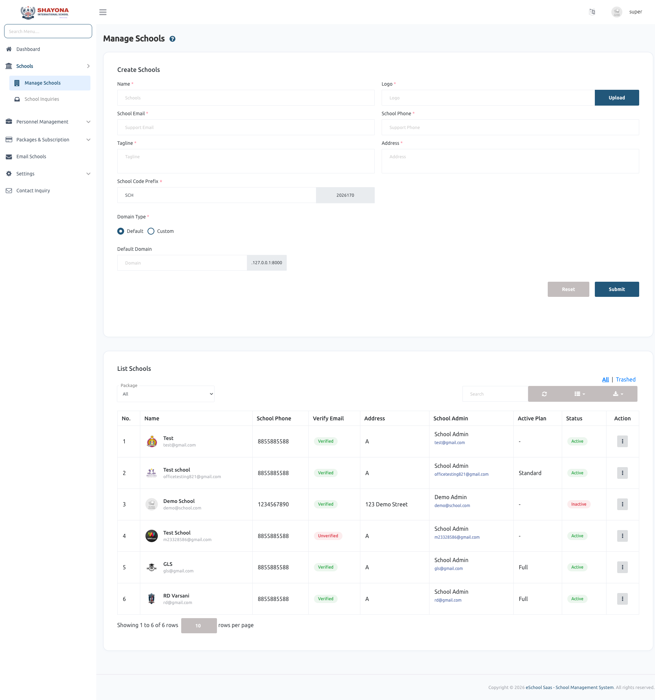

# Manage Schools

## School Management

### 1. School Creation
The Super Admin can create a new school from the system. During creation:
* A dedicated database is generated.
* Required tables are migrated.
* Default settings are configured.
* Login credentials are sent to the School Admin via email.
* The default password for the School Admin is set as their phone number.

### 2. Processing Time & Real-time Tracking
School creation is an automated background process that typically takes **2–5 minutes**. With the latest update, you can now track this progress in real-time.

*   **Real-time Progress**: A detailed tracking modal shows the exact step currently being executed (e.g., Database creation, Schema migration).
*   **Background Processing**: You can minimize the tracking modal and continue with other tasks while the system handles the installation.
*   **Status Indicators**: The school list displays a live progress bar and percentage for schools currently being installed.

> [!IMPORTANT]
> To enable real-time progress tracking, you must have **Laravel Reverb** correctly configured on your server. Without Reverb, the status will simply show as "Loading" until completion.
> [Learn how to configure Reverb here](../../../installation/admin-panel-installation/reverb-setup).

---

### 3. Installation Progress Overview
The installation tracking modal provides transparency into the multi-step provisioning process:

1.  **Starting setup**: Initializing the environment.
2.  **Database creation**: Provisioning a dedicated database for the school.
3.  **Schema migration**: Setting up the required table structures.
4.  **Configuration sync**: Applying default settings and school-specific configurations.
5.  **Administrative setup**: Creating the primary administrator account.
6.  **Welcome & Verification emails**: Sending credentials and verification links to the school admin.

---

### 4. School Access
The School Admin can access their admin panel using:
* Registered email
* Password (phone number by default)

### 5. School Management by Super Admin
The Super Admin has full control over schools, including:
* Updating school details
* Activating or deactivating a school
* Deleting a school

### 6. Activation / Deactivation Behavior
If a school is deactivated:
* Students and staff will not be able to log in.
* Access to the system is completely restricted for that school.

---

### Summary Flow
1. **Super Admin** creates a school.
2. **System** processes setup with real-time tracking (2–5 minutes).
3. **School Admin** receives login credentials.
4. **School** becomes active and accessible.
5. **Super Admin** can manage, update, deactivate, or delete the school.

