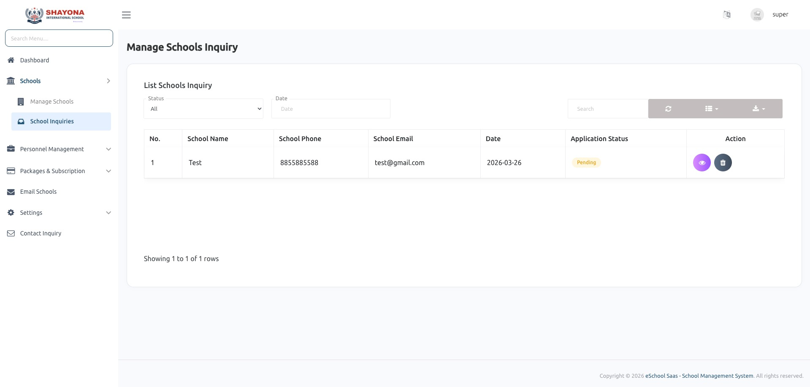

# School Inquiries

## Overview
Manage and respond to inquiries from prospective schools. If school inquiry is enable from the settings then school can register from the front site. And super admin can approve or reject the school inquiry. After approval school will be created.

## Key Features
- View inquiry list
- Track inquiry status
- Follow-up management

## Usage Instructions
1. Navigate to **Schools** > **School Inquiries**.
2. View the list of inquiries received through the contact form or registration landing page.
3. Use actions to update status or record follow-up notes.
