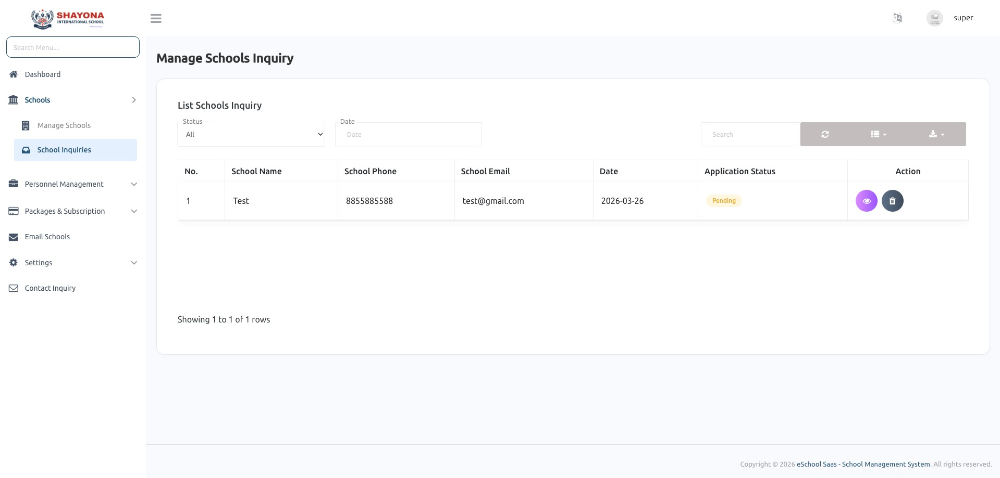

# School Inquiries

:::tip Prefer to watch?
The [School inquiries video tutorial](/tutorials/super-admin/school-inquiries/) shows the whole flow with the setting ON and OFF.
:::

## Overview
Schools can sign up from your website with **Start trial** (or **Register your school**). The **School inquiry** setting decides what happens to that request.

| School inquiry | What happens when a school submits the Start trial form |
| --- | --- |
| **ON** | The request is saved as an inquiry with status **Pending**. The school sees *"School inquiry sent to admin, wait for admin approval to successfully registered."* The school is created only when you approve it. |
| **OFF** | The school is created straight away and set up in the background. The school sees *"School creation process has been started. You will receive an email notification once the setup is complete."* No inquiry is saved. |

To change the setting, go to **Settings** > **System settings** > **General settings** > **Security & Server**, click the **School inquiry** card, and click **Submit**.

## Review an inquiry
1. Navigate to **Schools** > **School Inquiries**.
2. Each request shows the school's name, phone, email, date and **Application status**. Use the **Status** filter to show All, Pending or Rejected requests.
3. Click the **eye** icon to open a request. The school's details are read-only; you can still change the **School code prefix**.

## Approve or reject
- **Approve:** set **Application status** to **Approved** and click **Submit**. The school is registered, leaves the inquiry list, and appears in **Schools** > **Manage schools**, where it is set up like any school you create yourself.
- **Reject:** set **Application status** to **Rejected** and click **Submit**. The request stays in the list as **Rejected** and no school is created.
- **Delete:** use the **bin** icon to remove a request. Select several requests with the checkboxes to delete them together.

:::note
When School inquiry is OFF, the School Inquiries page shows a notice with a link to switch it back on.
:::
