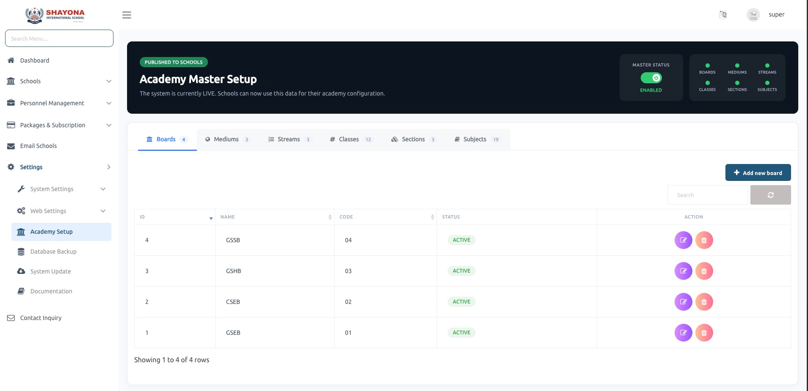

# Academy Master Setup

Provides a centralized interface for managing core academic master data used across all schools. It allows the Super Admin to define and publish structured academic configurations such as:
* Boards
* Mediums
* Streams
* Classes
* Sections
* Subjects

Once configured, this data is published to all schools and used as a base for their academic setup.

---

### Master Data Management
Super Admin can:
* Create, update, and delete academic master records.
* Manage each module via tab-based navigation (Boards, Mediums, Streams, etc.).
* Define unique codes and maintain status (Active/Inactive) for each record.
* Ensures standardized academic structure across the system.

---

### Master Status Control
* Displays overall **Master Setup Status** (Enabled/Disabled).
* Indicates whether master data is available for school-level usage.
* Shows count of configured records in each category (Boards, Classes, Subjects, etc.).

---

### School-Level Onboarding & Mapping
When a School Admin logs in for the first time:
* The system guides them through a step-by-step academy setup process.
* They are required to configure their academic structure using predefined master data.

**School Admin can:**
* Select and map Boards, Mediums, and Streams.
* Assign Classes, Sections, and Subjects based on master configuration.
* Ensures proper alignment between global master data and individual school setup.

---

### Setup Workflow
* Step-by-step guided process for school onboarding.
* Prevents incomplete or inconsistent academic configuration.
* Ensures all required mappings are completed before system usage.

---

### Key Features
* **Centralized academic data management** for multi-school systems.
* **Standardized and reusable master data** across all tenants.
* **Guided onboarding** for school admins with structured setup flow.
* **Flexible mapping** of master data to school-specific configurations.
* **Improves data consistency** and reduces manual setup errors.

:::tip[View Academy Setup Wizard for detailed guide]
- **Academy Setup Wizard**: For a detailed guide on how school administrators can quickly initialize their academic structure, refer to the [Academy Setup Wizard Documentation](../../../schooladmin/academy-setup-wizard/).
:::