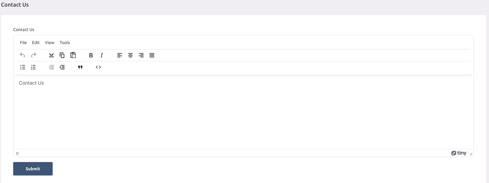

# Contact Us

## Overview
Manage the contact information and details displayed on the public front site.

## Key Features
- Update address, email, and phone
- Social media links
- Map integration

## Usage Instructions
1. Navigate to **Settings** > **System Settings** > **Contact Us**.
2. Update the contact details as required.
3. Save changes to update the public site.
