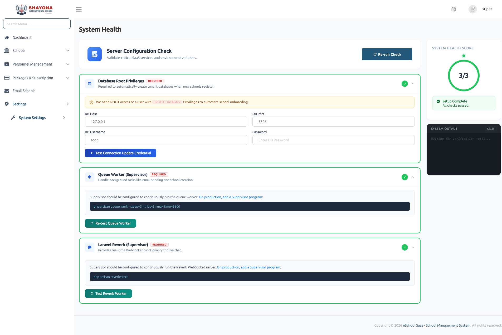

# Health

## System Health (Super Admin)
Provides a centralized interface to verify critical system configurations required for smooth application operation. It helps ensure that the server environment, database access, and background services are properly configured.

---

### Server Configuration Check
* Allows Super Admin to validate essential system services and environment variables.
* Option to re-run system checks to verify the latest configuration status.
* Displays overall **System Health Score** based on completed checks.

---

### Database Privileges Verification
Checks whether the database user has sufficient permissions. Validates the ability to:
* **Create new databases** (required for tenant/school onboarding).
* Access and manage existing databases.
* Requires root access or **CREATE DATABASE** privileges.
* Provides an option to test database connection and update credentials.

---

### Queue Worker (Supervisor) Status
Verifies whether the queue worker is properly configured and running. Ensures background jobs such as:
* Email sending.
* School creation and processing tasks.
* Displays required **Supervisor command** for setup.
* Allows re-testing of queue worker configuration.

---

### Laravel Reverb (WebSocket) Configuration
* Checks if real-time WebSocket service (Reverb) is configured correctly.
* Ensures real-time features like live updates or chat are operational.
* Provides required **Supervisor command** to run Reverb service.
* Option to test Reverb worker status.

---

### System Output & Monitoring
* Displays real-time logs and verification results.
* Helps identify configuration issues quickly.
* Shows success or failure messages for each check.

---

### Key Features
* **One-click system validation** and diagnostics.
* Ensures database, queue, and WebSocket services are properly configured.
* Helps prevent runtime issues due to misconfiguration.
* Simplifies server readiness checks for production environments.
* Provides clear status indicators for each required service.

