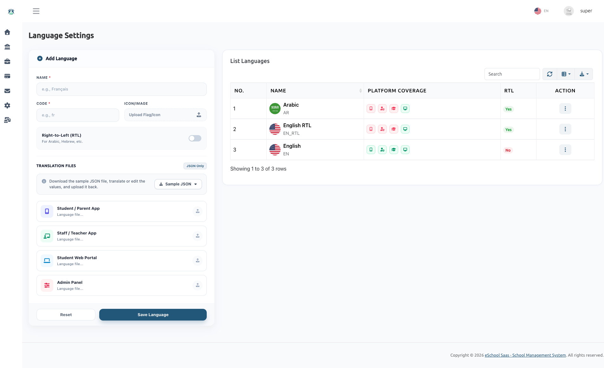

# Language Settings

## APP LOCALIZATION (LANGUAGE SETTINGS)
The App Localization Module empowers Super Admins to easily translate and manage multiple languages simultaneously across all eSchool SaaS platforms: the Student/Parent App, the Staff/Teacher App, the Student Web Portal, and the Admin Panel.

Navigate to **Super Admin Panel &rarr; Language Settings**.

### Overview & Key Features
- **Multi-Platform Coverage**: Upload and manage individual translation JSON files for four distinct platforms.
- **Right-to-Left (RTL) Support**: Toggle RTL layouts for languages like Arabic or Hebrew; the system and apps will automatically flip the UI direction when this language is selected.
- **Visual Platform Coverage Indicators**: The list table shows at-a-glance icon badges representing which platforms currently have translation files uploaded for each language.
- **Sample JSON Downloads**: Download base English sample JSON files to quickly translate and upload for any platform.
- **Safe Deletion Checks**: The system prevents accidental deletion of the base English language, the current default language, or any language assigned to active users.

### Adding a New Language
**Step-by-Step Guide:**
- **Basic Info**: Enter the Native Name (e.g., Français, العربية) and Language Code (e.g., fr, ar).
- **Icon & RTL**: Upload a flag icon representing the language. If the language is written Right-to-Left, toggle the RTL switch on.
- **Translation Files (JSON)**:
  - You can download sample JSON files by clicking the Sample JSON dropdown.
  - Translate the values in the JSON file using your text editor.
  - Upload the completed JSON files into their respective platform slots:
    - Student/Parent App
    - Staff/Teacher App
    - Student Web Portal
    - Admin Panel
- **Save**: Click Save Language to submit. The new language will immediately appear in the List Languages table and become available for selection across the system.

### Editing & Managing Language Files
**Editing a Language:**
- Click the **Action Menu (⋮) &rarr; Edit** next to a language in the list.
- In the Edit Modal, you can modify the Name, Code, Icon, and RTL setting.

**Manage JSON Files:**
- If a translation file is already uploaded, it will show a green **Uploaded** status. You can click the **Download** button to retrieve the current file or click **Replace** to upload an updated version.
- If a translation file is missing, it will display a warning. Click **Upload Now** to add the missing JSON file.