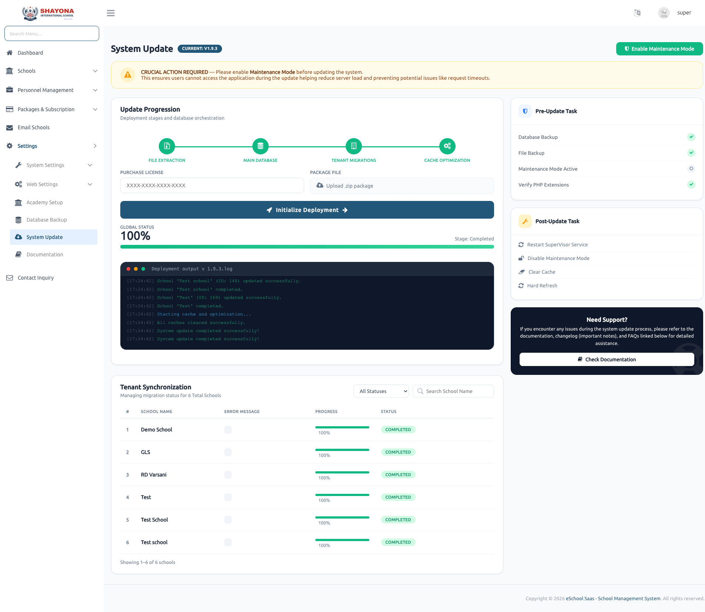

# System Update

Provides a centralized interface to update the system to the latest available version. It supports a seamless upgrade process for both global (main system) and tenant (school) databases.

---

### Update Process Overview
Super Admin can initiate a system update with a single action after providing the required inputs (Purchase Code and ZIP file).
* **File Extraction**: Core system files are extracted and replaced from the ZIP.
* **Database Migrations**: Applies changes to both main and tenant databases.
* **Data Seeders**: Executes seeders for required data updates.
* **Architecture**: Designed for multi-tenant architecture, ensuring consistent updates across all school databases.

---

### Multi-Tenant Update Handling
Automatically applies updates to:
* **Main (Central) Database**
* **Individual School (Tenant) Databases**
* Executes school-specific migrations and seeders in the background, ensuring data consistency across all tenants.

---

### Real-Time Progress Tracking
Displays live update progress using progress indicators for both:
* **Global System Update Status**
* **Individual School-wise Progress**
Provides clear visibility into completed, ongoing, and pending updates.

---

### Queue & Reverb Requirement
The update process depends on background job processing and real-time communication.
* **Laravel Queue (Supervisor)**: Required for handling update jobs.
* **Laravel Reverb (WebSocket)**: Required for real-time progress updates.
* Ensure these are properly configured to avoid tracking or execution failures.

---

### Pre-Update Validation
The system performs critical checks before starting:
* Purchase code and ZIP file integrity validation.
* Server configuration and database permissions check.
* Queue worker and Reverb/WebSocket availability check.

---

### Post-Update Verification
* Confirms all migrations and seeders executed successfully.
* Validates tenant database updates.
* Provides detailed success or failure status with logs.

---

### System Safety & Reliability
* **No Downgrade Support**: Once updated, the system cannot be rolled back to an older version.
* **Atomic Process**: Ensures a consistent upgrade across all tenants.
* **Pre-checks**: Minimizes risk by preventing updates if requirements are not met.

---

### Key Features
* One-click upgrade using purchase code and ZIP file.
* Multi-tenant database update support.
* Real-time progress tracking via WebSocket (Reverb).
* Background processing using Laravel Queue.
* Comprehensive pre and post-update validation.

